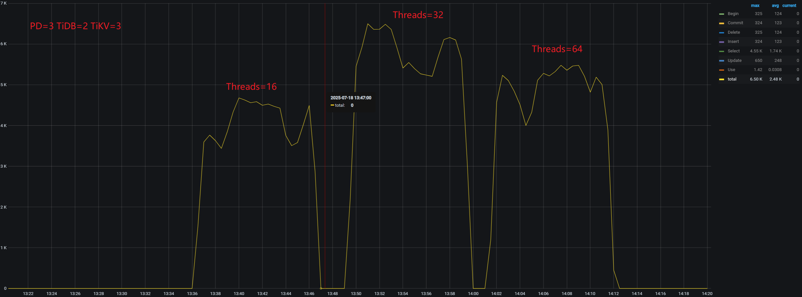
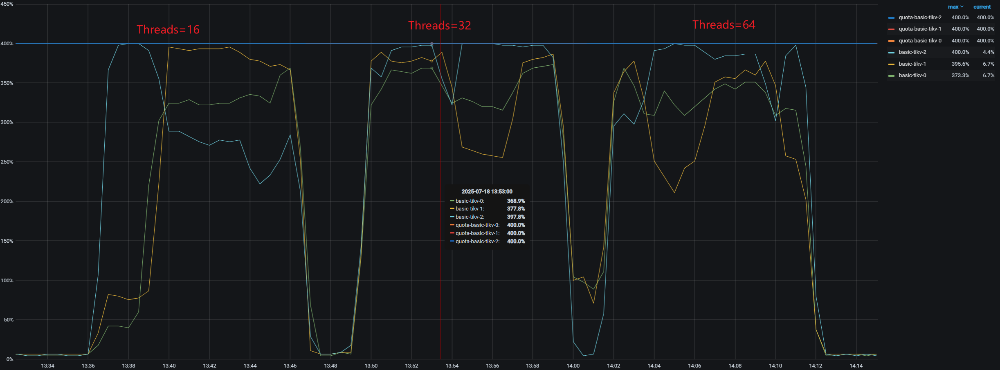
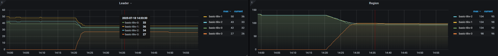
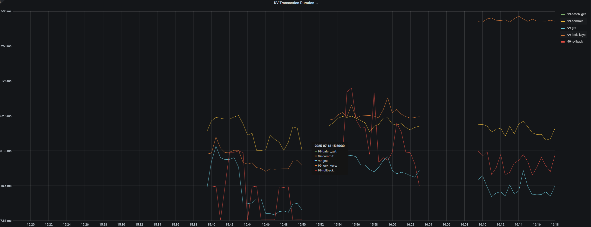
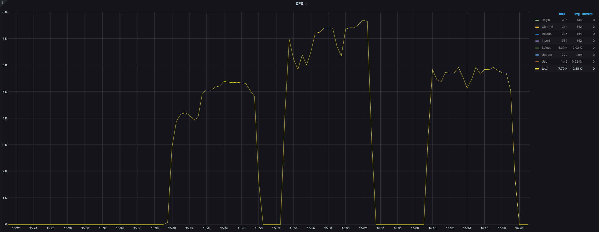

##  Reference
- https://docs.pingcap.com/zh/tidb/stable/benchmark-tidb-using-sysbench

## Performance Testing with Sysbench
1. Prepare `sysbench.job.yaml`
    ```yml
    kind: Job
    metadata:
    name: sysbench-for-mysql-oltp
    spec:
    backoffLimit: 4
    template:
        spec:
        containers:
        - name: sysbench
            image: docker.io/zyclonite/sysbench:latest
            command: ["/bin/sh", "-c"]
            args:
            - |
            set -e
            apk add --no-cache mariadb-client
            echo "Waiting for MySQL to be ready..."
            until mysql -h $MYSQL_HOST -P $MYSQL_PORT -u$MYSQL_USER -p$MYSQL_PASSWORD -e "SELECT 1" > /dev/null 2>&1; do
                sleep 5
            done
            echo "MySQL is ready!"
            echo "Dropping and creating database $MYSQL_DB..."
            mysql -h $MYSQL_HOST -P $MYSQL_PORT -u$MYSQL_USER -p$MYSQL_PASSWORD -e "DROP DATABASE IF EXISTS $MYSQL_DB;"
            mysql -h $MYSQL_HOST -P $MYSQL_PORT -u$MYSQL_USER -p$MYSQL_PASSWORD -e "CREATE DATABASE IF NOT EXISTS $MYSQL_DB;"
            echo "preparing data for sysbench..."
            sysbench oltp_read_write \
                --db-driver=mysql \
                --mysql-host=$MYSQL_HOST \
                --mysql-port=$MYSQL_PORT \
                --mysql-user=$MYSQL_USER \
                --mysql-password=$MYSQL_PASSWORD \
                --mysql-db=$MYSQL_DB \
                --table-size=$SYSBENCH_TABLE_SIZE \
                --tables=$SYSBENCH_TABLES \
                prepare
            echo "running sysbench..."
            sysbench oltp_read_write \
                --db-driver=mysql \
                --mysql-host=$MYSQL_HOST \
                --mysql-port=$MYSQL_PORT \
                --mysql-user=$MYSQL_USER \
                --mysql-password=$MYSQL_PASSWORD \
                --mysql-db=$MYSQL_DB \
                --threads=16 \
                --time=600 \
                --report-interval=10 \
                run > $SYSBENCH_OUTPUT_PATH
            echo "sysbench completed! please check the results at $SYSBENCH_OUTPUT_PATH"
            echo "cleaning up..."
            sysbench oltp_read_write \
                --db-driver=mysql \
                --mysql-host=$MYSQL_HOST \
                --mysql-port=$MYSQL_PORT \
                --mysql-user=$MYSQL_USER \
                --mysql-password=$MYSQL_PASSWORD \
                --mysql-db=$MYSQL_DB \
                cleanup
            env:
            - name: MYSQL_HOST
                value: "basic-tidb.tidb-cluster.svc.cluster.local"
            - name: MYSQL_PORT
                value: "4000"
            - name: MYSQL_USER
                value: "root"
            - name: MYSQL_PASSWORD
                valueFrom:
                secretKeyRef:
                    name: basic-tidb-credentials
                    key: root
            - name: MYSQL_DB
                value: "sysbench_test"
            - name: SYSBENCH_TABLE_SIZE
                value: "5000000"
            - name: SYSBENCH_TABLES
                value: "16"
            - name: SYSBENCH_OUTPUT_PATH
                value: "/results/sysbench_results.txt"
            volumeMounts:
            - name: results-volume
                mountPath: /results
        restartPolicy: Never
        volumes:
            - name: results-volume
            emptyDir: {}
    ```
2. Apply
    ```bash
    kubectl -n tidb-cluster apply -f sysbench.job.yaml
    ```
## See performance metrics in grafana

[Install the monitor](/docs/notes/database/TiDB/Monitor) if not.

## Example
The instance number of PD, TiDB, TiKV is 3, 2, 3.  
QPS

CPU


-  At 32 concurrency, the CPUs of all three nodes are nearly fully utilized.

-  At 64 concurrency, performance actually decreases due to lock contention.

Change the instance number of PD, TiDB, TiKV to 3, 3, 5, and wait the TiKV instance to balance its region.







16 4.68  
32 6.5k  
64 5.48k  

16 5.39k  15.2% ⬆️  
32 7.7k  18.5 ⬆️  
64 5.93k 8.2% ⬆️ 

- 