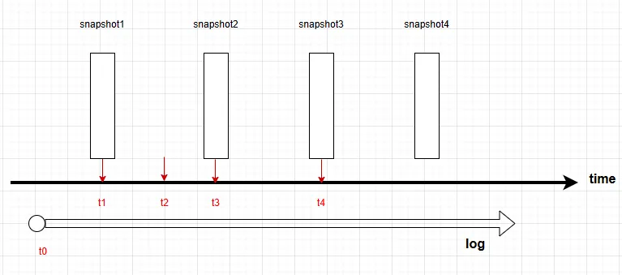
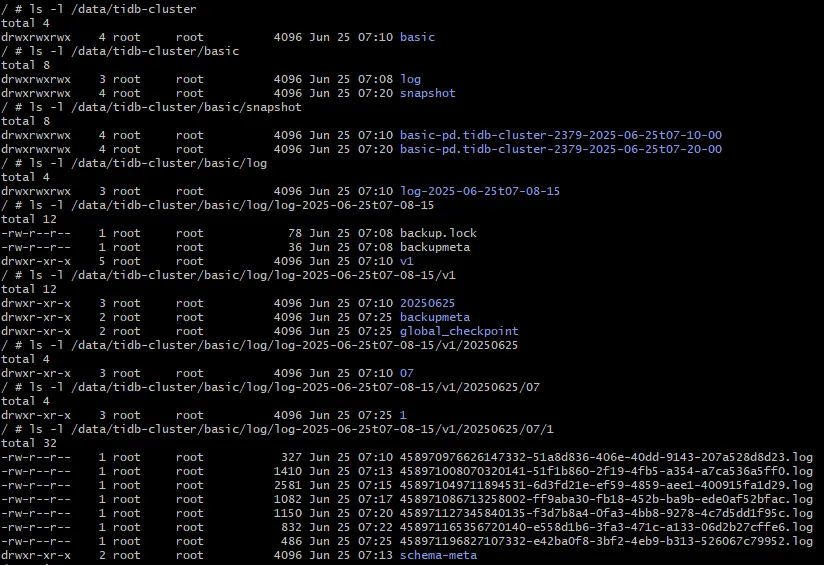
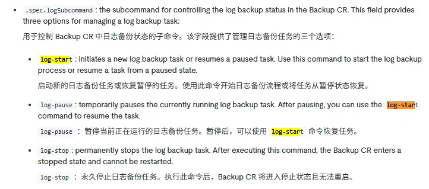

## TiDB BR

For more detailed information about BR, please refer to: [https://docs.pingcap.com/tidb/stable/use-br-command-line-tool/](https://docs.pingcap.com/tidb/stable/use-br-command-line-tool/)

TiDB BR provides the following features:

**Back up cluster data**: You can back up the full data of a cluster at a specific point in time (full backup), or back up data changes in TiDB (log backup, where "log" refers to KV changes in TiKV).

**Restore backup data**: You can restore a full backup, a specific database, or a table from a full backup.

Based on backup data (full and log backups), you can restore the target cluster to any point in time of the backup cluster. This type of restore is called Point-in-Time Recovery, or PITR for short.



```bash
tiup br backup full \
    --pd "${PD_IP}:2379" \
    --backupts '2024-06-28 13:30:00 +08:00' \
    --storage "s3://${backup_collection_addr}/snapshot-${date}?access-key=${access-key}&secret-access-key=${secret-access-key}" \
    --log-file backup_full.log
```

```bash
tiup br backup db \
    --pd "${PD_IP}:2379" \
    --db test \
    --storage "s3://${backup_collection_addr}/snapshot-${date}?access-key=${access-key}&secret-access-key=${secret-access-key}" \
    --log-file backup_table.log
```

```bash
tiup br log start \
  --task-name=pitr \
  --pd="${PD_IP}:2379" \
  --storage='s3://backup-101/logbackup?access-key=${access-key}&secret-access-key=${secret-access-key}'
```

```bash
tiup br restore point --pd="${PD_IP}:2379" \
--storage='s3://backup-101/logbackup?access-key=${access-key}&secret-access-key=${secret-access-key}' \
--full-backup-storage='s3://backup-101/snapshot-202205120000?access-key=${access-key}&secret-access-key=${secret-access-key}'
```

`--restored-ts string`

## TiDB Operator

TiDB Operator supports various tools for backup and restore. We will introduce the most commonly used tool, BR, which supports two types of backups:

  - **snapshot backup**: A full backup of a cluster, database, or table at a specific point in time.
  - **log backup**: An incremental backup.

`snapshot` + `log` can achieve PITR (Point-in-Time Restore), which is a restore to any point in time.

### PITR Limitations

  - PITR only supports restoring data to an empty cluster.
  - PITR only supports cluster-level restore, not database-level or table-level restore.
  - PITR does not support restoring user tables or privilege tables from system tables.
  - When restoring a cluster using PITR, no log backup tasks can be running.

TiDB Operator provides two backup Custom Resources (CRs).

For the configuration of related CRs, please refer to [https://docs.pingcap.com/tidb-in-kubernetes/stable/backup-restore-cr/](https://docs.pingcap.com/tidb-in-kubernetes/stable/backup-restore-cr/)

1.  `Backup`: Defines a one-time backup task. Specify `snapshot` or `log` in `spec.backupMode`.
2.  `BackupSchedule`: Defines a scheduled backup task. You can define specific `Backup` tasks under a `BackupSchedule`.

### Best Practices

The following is a best practice. By integrating snapshot and log backups under a `BackupSchedule`, you can achieve PITR.

#### Backup

[https://docs.pingcap.com/tidb-in-kubernetes/stable/backup-to-aws-s3-using-br/\#integrated-management-of-scheduled-snapshot-backup-log-backup-and-compact-log-backup](https://docs.pingcap.com/tidb-in-kubernetes/stable/backup-to-aws-s3-using-br/#integrated-management-of-scheduled-snapshot-backup-log-backup-and-compact-log-backup)

```yaml
apiVersion: pingcap.com/v1alpha1
kind: BackupSchedule
metadata:
  name: integrated-backup-schedule
  namespace: tidb-cluster
spec:
  maxReservedTime: "3h"
  schedule: "*/10 * * * *"
  backupTemplate:
    cleanPolicy: Delete
    resources:
      requests:
        cpu: "500m"
        memory: "512Mi"
      limits:
        cpu: "1000m"
        memory: "1Gi"
    backupMode: snapshot
    backupType: full
    toolImage: m.daocloud.io/docker.io/pingcap/br:v8.5.0
    br:
      cluster: basic
      clusterNamespace: tidb-cluster
      logLevel: info
      concurrency: 4
      # rateLimit: 0
      # checksum: true
    local:
      prefix: tidb-cluster/basic/snapshot
      volume:
        name: backup
        persistentVolumeClaim:
          claimName: tidb-cluster-backup-pvc
      volumeMount:
        name: backup
        mountPath: /backup
  logBackupTemplate:
    backupMode: log
    toolImage: m.daocloud.io/docker.io/pingcap/br:v8.5.0
    br:
      cluster: basic
      clusterNamespace: tidb-cluster
    local:
      prefix: tidb-cluster/basic/log
      volume:
        name: backup
        persistentVolumeClaim:
          claimName: tidb-cluster-backup-pvc
      volumeMount:
        name: backup
        mountPath: /backup
```

After two rounds of backups (with a few rows of data inserted in between), the files within the backup PVC are as follows:



You can see there is only one directory for the log backup, while a new directory is created for each snapshot backup.

#### Restore

As mentioned earlier, there is a PITR limitation: when restoring a cluster using PITR, no log backup tasks can be running. Therefore, we must first stop the ongoing log backup task. You can stop it by directly editing the current `logbackup` and changing `spec.logSubcommand` to `log-stop` to stop the log backup.



[https://docs.pingcap.com/tidb-in-kubernetes/stable/backup-restore-cr/\#backup-cr-fields](https://docs.pingcap.com/tidb-in-kubernetes/stable/backup-restore-cr/#backup-cr-fields)

```yaml
apiVersion: pingcap.com/v1alpha1
kind: Restore
metadata:
  name: pitr-restore-test
spec:
  restoreMode: pitr
  br:
    cluster: basic
    clusterNamespace: tidb-cluster
  local:
    prefix: tidb-cluster/basic/log/log-2025-06-25t08-16-43
    volume:
      name: backup
      persistentVolumeClaim:
        claimName: tidb-cluster-backup-pvc
    volumeMount:
      name: backup
      mountPath: /backup
  pitrRestoredTs: "2025-06-25T08:28:00+00:00"
  pitrFullBackupStorageProvider:
    local:
      prefix: tidb-cluster/basic/snapshot/basic-pd.tidb-cluster-2379-2025-06-25t08-20-00
      volume:
        name: backup
        persistentVolumeClaim:
          claimName: tidb-cluster-backup-pvc
      volumeMount:
        name: backup
        mountPath: /backup
```