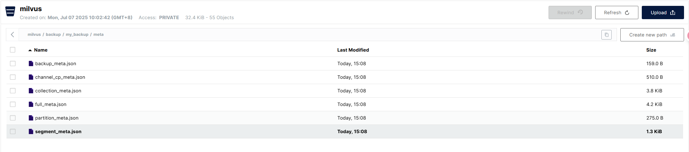

## Reference
- https://milvus.io/blog/how-to-use-milvus-backup-tool-step-by-step-guide.md#Preparation
- https://milvus.io/docs/milvus_backup_overview.md
- https://raw.githubusercontent.com/zilliztech/milvus-backup/master/configs/backup.yaml
- https://milvus.io/docs/milvus-cdc-overview.md


## Milvus-backup Tool
Milvus-backup is a data backup and recovery tool specifically developed by Zilliz for Milvus.  
Milvus-backup supports the following capabilities:
- Supports multiple interaction methods including command line and Restful API;
- Supports hot backup with minimal impact on Milvus cluster operations;
- Supports full cluster backup or specified collection backup;
- Achieve backup and recovery through bulkinsert, with the option to rename collections during recovery;
- Supports S3, cross-bucket backup, enabling migration between clusters;
- Compatible with Milvus versions 2.2.0 and above;
- Currently only supports backing up metadata, not index data.

### Command Overview
1. **General Help**: Type `milvus-backup help` to view the available commands and flags.
    ```
    milvus-backup is a backup&restore tool for milvus.

    Usage:
    milvus-backup [flags]
    milvus-backup [command]

    Available Commands:
    check       check if the connects is right.
    create      create subcommand create a backup.
    delete      delete subcommand delete backup by name.
    get         get subcommand get backup by name.
    help        Help about any command
    list        list subcommand shows all backup in the cluster.
    restore     restore subcommand restore a backup.
    server      server subcommand start milvus-backup RESTAPI server.

    Flags:
        --config string   config YAML file of milvus (default "backup.yaml")
    -h, --help            help for milvus-backup

    Use "milvus-backup [command] --help" for more information about a command.
    ```
2. **Creating a Backup**: Get specific help for creating a backup by typing `milvus-backup create --help`.
    ```
    Usage:
    milvus-backup create [flags]

    Flags:
    -n, --name string                   backup name, if unset will generate a name automatically
    -c, --colls string                  collectionNames to backup, use ',' to connect multiple collections
    -d, --databases string              databases to backup
    -a, --database_collections string   databases and collections to backup, json format: {"db1":["c1", "c2"],"db2":[]}
    -f, --force                         force backup, will skip flush, should make sure data has been stored into disk when using it
        --meta_only                     only backup collection meta instead of data
    -h, --help                          help for create
    ```
3. **Restoring a Backup**: To understand how to restore a backup, use `milvus-backup restore --help`.
    ```
    Usage:
    milvus-backup restore [flags]

    Flags:
    -n, --name string                   backup name to restore
    -c, --collections string            collectionNames to restore
    -s, --suffix string                 add a suffix to collection name to restore
    -r, --rename string                 rename collections to new names, format: db1.collection1:db2.collection1_new,db1.collection2:db2.collection2_new
    -d, --databases string              databases to restore, if not set, restore all databases
    -a, --database_collections string   databases and collections to restore, json format: {"db1":["c1", "c2"],"db2":[]}
        --meta_only                     if true, restore meta only
        --restore_index                 if true, restore index
        --use_auto_index                if true, replace vector index with autoindex
        --drop_exist_collection         if true, drop existing target collection before create
        --drop_exist_index              if true, drop existing index of target collection before create
        --skip_create_collection        if true, will skip collection, use when collection exist, restore index or data
    -h, --help                          help for restore
    ```
    
### Backup/Restore Use Cases
There are several use cases in which the milvus-backup tool can be applied effectively, depending on your specific needs and configurations:

1. **Within a Single Milvus Instance**: Copy a collection to a new one within the same Milvus service.

2. **Between Milvus Instances in a Single S3 with One Bucket**: Transfer a collection between Milvus instances with different root paths but using the same S3 bucket.

3. **Between Milvus Instances Across Different S3 Buckets**: Transfer a collection between different S3 buckets within the same S3 service.

4. **Across Different S3 Services**: Copy a collection between Milvus instances that are using different S3 services.

Here, we only test backup and recovery within a single milvus cluster. If you need to restore from Cluster A to Cluster B, you'll need to modify the configuration file by adjusting the Milvus and MinIO connection settings. https://milvus.io/docs/milvus_backup_overview.md.

## Workflow of backup and restore
### Data Preparation
Collection named "quick_setup" will be created and 10 records will be inserted into it.
1. Prepare `prepare-data.job.yaml`
    ```yaml
    apiVersion: batch/v1
    kind: Job
    metadata:
      name: milvus-prepare-job
    spec:
      template:
        spec:
          containers:
          - name: pymilvus-prepare-data
            image: m.lab.zverse.space/docker.io/bitnami/pymilvus:latest
            command: ['python', '-c']
            args:
              - |
                from pymilvus import MilvusClient, DataType
                import os
                collection_name = os.getenv("COLLECTION_NAME")

                client = MilvusClient(
                    uri=os.getenv("MILVUS_URI"),
                    token=os.getenv("MILVUS_TOKEN")
                )

                # Create schema
                schema = MilvusClient.create_schema(
                    auto_id=False,
                    enable_dynamic_field=True,
                )

                # Add fields to schema
                schema.add_field(field_name="id", datatype=DataType.INT64, is_primary=True)
                schema.add_field(field_name="vector", datatype=DataType.FLOAT_VECTOR, dim=5)
                schema.add_field(field_name="color", datatype=DataType.VARCHAR, max_length=512)

                # Prepare index parameters
                index_params = client.prepare_index_params()
                # Add indexes
                index_params.add_index(
                    field_name="id",
                    index_type="AUTOINDEX"
                )
                index_params.add_index(
                    field_name="vector",
                    index_type="AUTOINDEX",
                    metric_type="COSINE"
                )

                # Create a collection with the index loaded simultaneously
                client.create_collection(
                    collection_name=collection_name,
                    schema=schema,
                    index_params=index_params
                )
                res = client.list_collections()
                print(res)
                res = client.get_load_state(
                    collection_name=res[0]
                )
                print(res)

                # Insert entities into collection
                data=[
                    {"id": 0, "vector": [0.3580376395471989, -0.6023495712049978, 0.18414012509913835, -0.  26286205330961354, 0.9029438446296592], "color": "pink_8682"},
                    {"id": 1, "vector": [0.19886812562848388, 0.06023560599112088, 0.6976963061752597, 0.   2614474506242501, 0.838729485096104], "color": "red_7025"},
                    {"id": 2, "vector": [0.43742130801983836, -0.5597502546264526, 0.6457887650909682, 0.   7894058910881185, 0.20785793220625592], "color": "orange_6781"},
                    {"id": 3, "vector": [0.3172005263489739, 0.9719044792798428, -0.36981146090600725, -0.  4860894583077995, 0.95791889146345], "color": "pink_9298"},
                    {"id": 4, "vector": [0.4452349528804562, -0.8757026943054742, 0.8220779437047674, 0.    46406290649483184, 0.30337481143159106], "color": "red_4794"},
                    {"id": 5, "vector": [0.985825131989184, -0.8144651566660419, 0.6299267002202009, 0. 1206906911183383, -0.1446277761879955], "color": "yellow_4222"},
                    {"id": 6, "vector": [0.8371977790571115, -0.015764369584852833, -0.31062937026679327, -0.   562666951622192, -0.8984947637863987], "color": "red_9392"},
                    {"id": 7, "vector": [-0.33445148015177995, -0.2567135004164067, 0.8987539745369246, 0.  9402995886420709, 0.5378064918413052], "color": "grey_8510"},
                    {"id": 8, "vector": [0.39524717779832685, 0.4000257286739164, -0.5890507376891594, -0.  8650502298996872, -0.6140360785406336], "color": "white_9381"},
                    {"id": 9, "vector": [0.5718280481994695, 0.24070317428066512, -0.3737913482606834, -0.  06726932177492717, -0.6980531615588608], "color": "purple_4976"}
                ]
                res = client.insert(
                    collection_name=collection_name,
                    data=data
                )
                print(res)
            env:
              - name: MILVUS_URI
                value: http://milvus-577-proxy.middleware-csst.svc.cluster.local:19530
              - name: MILVUS_TOKEN
                value: "user:pwd"
              - name: COLLECTION_NAME
                value: quick_setup
          restartPolicy: Never
      backoffLimit: 0
    ```
2. Apply
    ```bash
    kubectl -n middleware-csst apply -f prepare-data.job.yaml
    kubectl -n middleware-csst get pod
    kubectl -n middleware-csst logs milvus-prepare-job-hbvkj
    ```

### Backup All Collections
1. Prepare `backup.job.yaml`
    ```yml
    apiVersion: v1
    kind: ConfigMap
    metadata:
      name: milvus-backup-config
    data:
      backup.yaml: |
        log:
          file:
            rootPath: "logs/backup.log"
        milvus:
          address: "milvus-577-proxy.middleware-csst.svc.cluster.local"
          port: 19530
          user: "user"
          password: "pwd"

          # tls mode values [0, 1, 2]
          # 0 is close, 1 is one-way authentication, 2 is mutual authentication
          tlsMode: 0

        # Related configuration of minio, which is responsible for data persistence for Milvus.
        minio:
          # Milvus storage configs, make them the same with milvus config
          storageType: "minio" # support storage type: local, minio, s3, aws, gcp, ali(aliyun), azure, tc   (tencent), gcpnative
          address: "milvus-577-minio.middleware-csst.svc.cluster.local" # Address of MinIO/S3
          port: 9000   # Port of MinIO/S3
          accessKeyID: "admin"  # accessKeyID of MinIO/S3
          secretAccessKey: "admin" # MinIO/S3 encryption string
          useSSL: false # Access to MinIO/S3 with SSL
          useIAM: false
          iamEndpoint: ""
          bucketName: "milvus" # Milvus Bucket name in MinIO/S3, make it the same as your milvus instance
          rootPath: "file" # Milvus storage root path in MinIO/S3, make it the same as your milvus instance

          # Backup storage configs, the storage you want to put the backup data
          backupStorageType: "minio" # support storage type: local, minio, s3, aws, gcp, ali(aliyun), azure, tc (tencent)
          backupAddress: "milvus-577-minio.middleware-csst.svc.cluster.local" # Address of MinIO/S3
          backupPort: 9000   # Port of MinIO/S3
          backupAccessKeyID: "admin"  # accessKeyID of MinIO/S3
          backupSecretAccessKey: "admin" # MinIO/S3 encryption string
          backupBucketName: "milvus" # Bucket name to store backup data. Backup data will store to  backupBucketName/backupRootPath
          backupRootPath: "backup" # Rootpath to store backup data. Backup data will store to backupBucketName/ backupRootPath
          backupUseSSL: false # Access to MinIO/S3 with SSL
    ---

    apiVersion: batch/v1
    kind: Job
    metadata:
      name: milvus-backup-job
    spec:
      template:
        spec:
          containers:
          - name: milvus-backup
            image: m.lab.zverse.space/docker.io/milvusdb/milvus-backup:latest
            command: ['sh', '-c']
            args:
              - |
                # All collections will be backup
                ./milvus-backup create -n my_backup --config /data/backup.yaml
            env:
              - name: MILVUS_URI
                value: http://milvus-577-proxy.middleware-csst.svc.cluster.local:19530
              - name: MILVUS_TOKEN
                value: "user:pwd"
            volumeMounts:
              - name: config-volume
                mountPath: /data
          volumes:
            - name: config-volume
              configMap:
                name: milvus-backup-config
                defaultMode: 0755
          restartPolicy: Never

      backoffLimit: 0
    ```
2. Apply
    ```
    kubectl -n middleware-csst apply -f backup.job.yaml
    ```
3. Check  
After execution, we can check the backup files via MinIO's UI. It can be seen that under the path backup (consistent with the configuration), a directory named my_backup has been created, containing two folders that store the backup metadata (meta) and the actual data (binlog) respectively.

Under the meta directory are some metadata files, which record the metadata at the backup, collection, partition, and segment levels.


### Clean Data
Delete Collection `quick_setup`.
1. Prepare `clean-data.job.yaml`
    ```yaml
    apiVersion: batch/v1
    kind: Job
    metadata:
      name: milvus-clean-job
    spec:
      template:
        spec:
          containers:
          - name: milvus-clean
            image: m.lab.zverse.space/docker.io/bitnami/pymilvus:latest
            command: ['python', '-c']
            args:
              - |
                from pymilvus import connections, utility
                import os

                host = os.getenv("MILVUS_HOST")
                port = os.getenv("MILVUS_PORT")
                user = os.getenv("MILVUS_USER")
                pwd = os.getenv("MILVUS_PWD")
                collection_name = os.getenv("COLLECTION_NAME")
                connections.connect("default", host=host, port=port, user=user, password=pwd)

                print(f"Drop collection '{collection_name}'")
                utility.drop_collection(collection_name)
            env:
              - name: MILVUS_HOST
                value: milvus-577-proxy.middleware-csst.svc.cluster.local
              - name: MILVUS_PORT
                value: "19530"
              - name: MILVUS_USER
                value: user
              - name: MILVUS_PWD
                value: pwd
              - name: COLLECTION_NAME
                value: quick_setup
          restartPolicy: Never
      backoffLimit: 0
    ```
2. Apply
    ```bash
    kubectl -n middleware-csst apply -f clean-data.job.yaml
    ```

### Restore
If no collection with the same name exists in the target cluster, it can be restored with its original name.If a collection with the same name exists in the target cluster, you can use the `-s` or `--suffix` parameter to set a uniform suffix. For example, `quick_setup` would be restored as `quick_setup_recover`.
1. Prepare `restore.job.yaml`
    ```yaml
    apiVersion: v1
    kind: ConfigMap
    metadata:
      name: milvus-backup-config
    data:
      backup.yaml: |
        log:
          file:
            rootPath: "logs/backup.log"
        milvus:
          address: "milvus-577-proxy.middleware-csst.svc.cluster.local"
          port: 19530
          user: "uesr"
          password: "pwd"

          # tls mode values [0, 1, 2]
          # 0 is close, 1 is one-way authentication, 2 is mutual authentication
          tlsMode: 0

        # Related configuration of minio, which is responsible for data persistence for Milvus.
        minio:
          # Milvus storage configs, make them the same with milvus config
          storageType: "minio" # support storage type: local, minio, s3, aws, gcp, ali(aliyun), azure, tc   (tencent), gcpnative
          address: "milvus-577-minio.middleware-csst.svc.cluster.local" # Address of MinIO/S3
          port: 9000   # Port of MinIO/S3
          accessKeyID: "admin"  # accessKeyID of MinIO/S3
          secretAccessKey: "admin" # MinIO/S3 encryption string
          useSSL: false # Access to MinIO/S3 with SSL
          useIAM: false
          iamEndpoint: ""
          bucketName: "milvus" # Milvus Bucket name in MinIO/S3, make it the same as your milvus instance
          rootPath: "file" # Milvus storage root path in MinIO/S3, make it the same as your milvus instance

          # Backup storage configs, the storage you want to put the backup data
          backupStorageType: "minio" # support storage type: local, minio, s3, aws, gcp, ali(aliyun), azure, tc (tencent)
          backupAddress: "milvus-577-minio.middleware-csst.svc.cluster.local" # Address of MinIO/S3
          backupPort: 9000   # Port of MinIO/S3
          backupAccessKeyID: "admin"  # accessKeyID of MinIO/S3
          backupSecretAccessKey: "admin" # MinIO/S3 encryption string
          backupBucketName: "milvus" # Bucket name to store backup data. Backup data will store to  backupBucketName/backupRootPath
          backupRootPath: "backup" # Rootpath to store backup data. Backup data will store to backupBucketName/ backupRootPath
          backupUseSSL: false # Access to MinIO/S3 with SSL
    ---

    apiVersion: batch/v1
    kind: Job
    metadata:
      name: milvus-restore-job
    spec:
      template:
        spec:
          containers:
          - name: milvus-restore
            image: m.lab.zverse.space/docker.io/milvusdb/milvus-backup:latest
            command: ['sh', '-c']
            args:
              - |
                # All collections will be restore with a suffix "_recover"
                ./milvus-backup restore -n my_backup --restore_index=true -s _recover --config=/data/backup.yaml
            env:
              - name: MILVUS_URI
                value: http://milvus-577-proxy.middleware-csst.svc.cluster.local:19530
              - name: MILVUS_TOKEN
                value: "user:pwd"
            volumeMounts:
              - name: config-volume
                mountPath: /data
          volumes:
            - name: config-volume
              configMap:
                name: milvus-backup-config
          restartPolicy: Never

      backoffLimit: 0
    ```
2. Apply
    ```
    kubectl -n middleware-csst apply -f restore.job.yaml
    ```

### Check Data Restored
Because flag `-s _recover` has been used in backup command, collection there to be check is `quick_setup_recover`.
1. Prepare `query-data.job.yaml`
    ```yaml
    apiVersion: batch/v1
    kind: Job
    metadata:
      name: milvus-query-job
    spec:
      template:
        spec:
          containers:
          - name: pymilvus-query-data
            image: m.lab.zverse.space/docker.io/bitnami/pymilvus:latest
            command: ['python', '-c']
            args:
              - |
                from pymilvus import MilvusClient, DataType
                import os
                collection_name = os.getenv("COLLECTION_NAME")

                client = MilvusClient(
                    uri=os.getenv("MILVUS_URI"),
                    token=os.getenv("MILVUS_TOKEN")
                )

                load_state = client.get_load_state(collection_name=collection_name)
                print(f"Collection '{collection_name}' current load state: {load_state}")
                if load_state.get('state') != 'LoadState.Loaded':
                  client.load_collection(collection_name=collection_name)
                  print(f"Collection '{collection_name}' has loaded")

                query_vector = [0.3580376395471989, -0.6023495712049978, 0.18414012509913835, -0.   26286205330961354, 0.9029438446296592]
                res = client.search(
                    collection_name=os.getenv("COLLECTION_NAME"),
                    anns_field="vector",
                    data=[query_vector],
                    limit=3,
                    search_params={"metric_type": "COSINE"}
                )

                for hits in res:
                    for hit in hits:
                        print(hit)
            env:
              - name: MILVUS_URI
                value: http://milvus-577-proxy.middleware-csst.svc.cluster.local:19530
              - name: MILVUS_TOKEN
                value: "user:pwd"
              - name: COLLECTION_NAME
                value: quick_setup_recover
          restartPolicy: Never
      backoffLimit: 0
    ```
2. Apply
    ```bash
    kubectl -n middleware-csst apply -f query-data.job.yaml
    kubectl -n middleware-csst get pod
    kubectl -n middleware-csst logs milvus-query-job-bnbp5
    ```

## Best Practices
To implement scheduled backups, I provided the following prompt to the AI and asked it to expand on bakcup job. Below is the YAML output generated by the AI.
1. Change `Job` to `CronJob`.

2. Add a shell script：

  - Create a new backup：using `milvus-backup create`.

  - List all backups：using `milvus-backup list`.

  - Delete old backups：according the max numer of backups to keep ，find and delete the old backups，using `milvus-backup delete`.

3. Set up the max numer of backups to keep：add a env `MAX_BACKUPS_TO_KEEP` in CronJob. 

:::warning
 Please note that this YAML has not been tested in any way and is only meant to document the thought process!
:::

```yaml
apiVersion: v1
kind: ConfigMap
metadata:
  name: milvus-backup-config
data:
  backup.yaml: |
    log:
      file:
        rootPath: "logs/backup.log"
    milvus:
      address: "milvus-577-proxy.middleware-csst.svc.cluster.local"
      port: 19530
      user: "user"
      password: "pwd"

      # tls mode values [0, 1, 2]
      # 0 is close, 1 is one-way authentication, 2 is mutual authentication
      tlsMode: 0

    # Related configuration of minio, which is responsible for data persistence for Milvus.
    minio:
      # Milvus storage configs, make them the same with milvus config
      storageType: "minio" # support storage type: local, minio, s3, aws, gcp, ali(aliyun), azure, tc(tencent), gcpnative
      address: "milvus-577-minio.middleware-csst.svc.cluster.local" # Address of MinIO/S3
      port: 9000   # Port of MinIO/S3
      accessKeyID: "admin"  # accessKeyID of MinIO/S3
      secretAccessKey: "admin" # MinIO/S3 encryption string
      useSSL: false # Access to MinIO/S3 with SSL
      useIAM: false
      iamEndpoint: ""
      bucketName: "milvus" # Milvus Bucket name in MinIO/S3, make it the same as your milvus instance
      rootPath: "file" # Milvus storage root path in MinIO/S3, make it the same as your milvus instance

      # Backup storage configs, the storage you want to put the backup data
      backupStorageType: "minio" # support storage type: local, minio, s3, aws, gcp, ali(aliyun), azure, tc(tencent)
      backupAddress: "milvus-577-minio.middleware-csst.svc.cluster.local" # Address of MinIO/S3
      backupPort: 9000   # Port of MinIO/S3
      backupAccessKeyID: "admin"  # accessKeyID of MinIO/S3
      backupSecretAccessKey: "admin" # MinIO/S3 encryption string
      backupBucketName: "milvus" # Bucket name to store backup data. Backup data will store to backupBucketName/backupRootPath
      backupRootPath: "backup" # Rootpath to store backup data. Backup data will store to backupBucketName/backupRootPath
      backupUseSSL: false # Access to MinIO/S3 with SSL
---
apiVersion: batch/v1
kind: CronJob # <--- 从 Job 修改为 CronJob
metadata:
  name: milvus-daily-backup
spec:
  schedule: "0 2 * * *" # <--- 定时调度：每天凌晨2点执行 (Cron 表达式)
  jobTemplate: # <--- CronJob 需要包含 jobTemplate
    spec:
      template:
        spec:
          containers:
          - name: milvus-backup-controller
            image: m.lab.zverse.space/docker.io/milvusdb/milvus-backup:latest
            command: ['/bin/sh', '-c'] # <--- 明确使用 sh 解释器
            args:
              - |
                set -eo pipefail # 脚本出错时立即退出

                BACKUP_CONFIG_PATH="/data/backup.yaml"
                TIMESTAMP=$(date +%Y%m%d%H%M%S)
                BACKUP_NAME="full-backup-${TIMESTAMP}" # 使用时间戳作为备份名称

                echo "--- Starting Milvus backup at ${TIMESTAMP} ---"

                # 1. 创建新的全量备份
                echo "Creating new backup: ${BACKUP_NAME}"
                ./milvus-backup create -n "${BACKUP_NAME}" --config "${BACKUP_CONFIG_PATH}"
                if [ $? -ne 0 ]; then
                  echo "Error: Failed to create backup. Exiting."
                  exit 1
                fi
                echo "Backup '${BACKUP_NAME}' created successfully."

                # 2. 列出所有备份并按时间排序
                echo "Listing existing backups..."
                # milvus-backup list 命令输出格式可能不稳定，这里假设按时间降序排列
                # 或者需要进一步处理输出以获取名称和时间戳
                # 为了简化，这里假设`milvus-backup list`的输出每行一个备份名称，最新在上面。
                # 生产环境需要更健壮的解析，例如解析JSON输出。
                BACKUPS=$(./milvus-backup list --config "${BACKUP_CONFIG_PATH}" | grep -Eo 'full-backup-[0-9]{14}' | sort -r) # 提取备份名称并按降序排序（最新在前）

                # 计算要保留的数量 (从环境变量获取)
                MAX_TO_KEEP=${MAX_BACKUPS_TO_KEEP:-5} # 默认保留5个，如果环境变量未设置

                echo "Configured to keep a maximum of ${MAX_TO_KEEP} backups."

                # 3. 删除旧的备份，只保留最新的 MAX_TO_KEEP 份
                COUNT=0
                BACKUPS_TO_DELETE=""
                for B_NAME in ${BACKUPS}; do
                  COUNT=$((COUNT + 1))
                  if [ ${COUNT} -gt ${MAX_TO_KEEP} ]; then
                    BACKUPS_TO_DELETE="${BACKUPS_TO_DELETE} ${B_NAME}"
                  fi
                done

                if [ -n "${BACKUPS_TO_DELETE}" ]; then
                  echo "Deleting old backups: ${BACKUPS_TO_DELETE}"
                  for DEL_NAME in ${BACKUPS_TO_DELETE}; do
                    echo "Deleting backup: ${DEL_NAME}"
                    ./milvus-backup delete -n "${DEL_NAME}" --config "${BACKUP_CONFIG_PATH}" --yes # --yes 避免交互式确认
                    if [ $? -ne 0 ]; then
                      echo "Warning: Failed to delete backup '${DEL_NAME}'. Continuing."
                    fi
                  done
                  echo "Old backups deleted."
                else
                  echo "No old backups to delete."
                fi

                echo "--- Milvus backup and cleanup finished ---"

            env:
              - name: MAX_BACKUPS_TO_KEEP # <--- 新增环境变量，控制保留数量
                value: "5" # 例如，保留最新的5个全量备份
              # Milvus 连接信息通过 ConfigMap 挂载的 backup.yaml 提供，以下环境变量不再需要
              # - name: MILVUS_URI
              #   value: http://milvus-577-proxy.middleware-csst.svc.cluster.local:19530
              # - name: MILVUS_TOKEN
              #   value: "user:pwd"
            volumeMounts:
              - name: config-volume
                mountPath: /data # <--- 挂载 ConfigMap
          volumes:
            - name: config-volume
              configMap:
                name: milvus-backup-config
                defaultMode: 0644
          restartPolicy: OnFailure # <--- Job 失败时重启，直到成功或达到 backoffLimit
          # 对于 CronJob 的 Job，通常希望失败重试，所以 restartPolicy: OnFailure 更合适
          # backoffLimit: 0 意味着失败不重试，通常不推荐用于定时任务
          # 如果希望失败重试 N 次，可以设置 backoffLimit: N (默认6次)
```