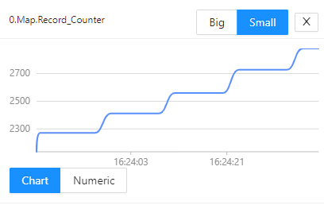
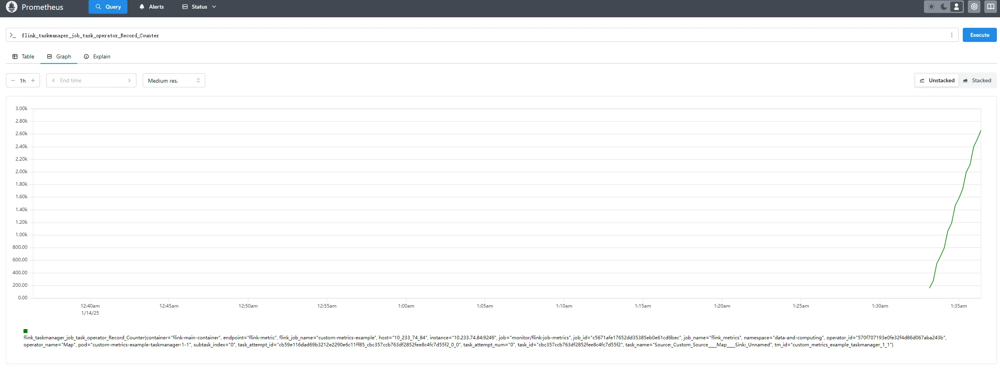
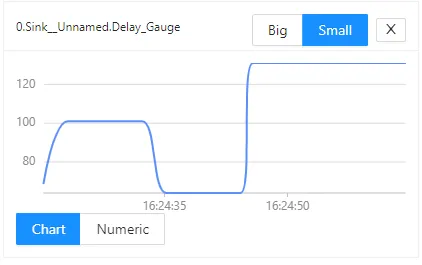
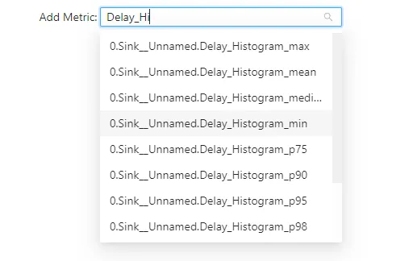
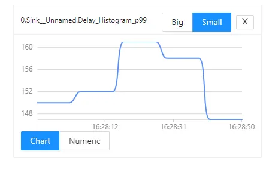
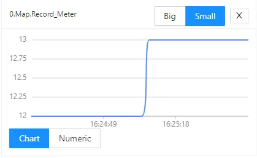
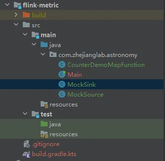

## Reference
- [Flink 1.19 Metric System Official Documentation](https://nightlies.apache.org/flink/flink-docs-release-1.9/monitoring/metrics.html)
- [Flink-k8s-operator Metric System Official Documentation](https://nightlies.apache.org/flink/flink-kubernetes-operator-docs-release-1.10/docs/operations/metrics-logging/)

## Overview
The metric system of Flink can only be accessed within RichFunction. Flink supports four types of metrics in total: Counters, Gauges, Histograms, and Meters. There are differences between the Flink metric types and Prometheus metric types. An overview of Flink's metric types is shown in the following table:

| Flink Metrics | Corresponding Prometheus Metrics | Usage | <font style="color:#DF2A3F;">Note</font> |
| --- | --- | --- | --- |
| Counter | Gauge | Counting, such as the total number of requests	 | The Flink Counter can be increased or decreased, while Prometheus can only increase |
| Gauge | Gauge | Recording instantaneous values, such as CPU usage	 | |
| Histogram | Summary | Providing statistical information, such as maximum, minimum, average, 95th percentile, and 99th percentile of latency	 | Flink itself does not provide an implementation and requires additional dependencies. |
| Meter | Gauge | Providing throughput statistics | Flink itself does not provide an implementation and requires additional dependencies. |


## Counter
The counter metric is used for counting, such as the total number of requests. You can call inc()/inc(long n) or dec()/dec(long n) to increase or decrease a counter metric by 1 or other quantities.
Here, a counter metric is simulated, and the records sent by the source are counted in the mapFunction immediately following the source:

```java
package com.zhejianglab.astronomy;

import org.apache.flink.api.common.functions.OpenContext;
import org.apache.flink.api.common.functions.RichMapFunction;
import org.apache.flink.metrics.Counter;

public class CounterDemoMapFunction extends RichMapFunction<Long, Long> {
    private transient Counter counter;

    @Override
    public void open(OpenContext openContext) throws Exception {
        super.open(openContext);
        this.counter = getRuntimeContext()
                .getMetricGroup()
                .counter("Record_Counter");
    }

    @Override
    public Long map(Long value) throws Exception {
        this.counter.inc();
        return value;
    }
}

```


After defining it, you can view this metric on the Flink web:



When deployed on k8s, you can view this metric on Prometheus.



## Guage
The gauge metric is used to temporarily record certain instantaneous values, typically such as CPU and memory usage. You can use this metric when you only care about the current value and not statistical information.
Here, a gauge metric is simulated. In the sink, the delay of records from the source to the sink is recorded (the record itself contains the timestamp generated at the source). Here, the meaning of this metric is "the delay of the most recently arrived record at the sink", which is an instantaneous value:

```java
package com.zhejianglab.astronomy;

import org.apache.flink.api.common.functions.OpenContext;
import org.apache.flink.metrics.Gauge;
import org.apache.flink.streaming.api.functions.sink.RichSinkFunction;

import java.util.concurrent.TimeUnit;

public class MockSink extends RichSinkFunction<Long> {
    private transient long delay = 0;

    @Override
    public void open(OpenContext openContext) throws Exception {
        super.open(openContext);
        getRuntimeContext()
                .getMetricGroup()
                .gauge("Delay_Gauge", new Gauge<Long>() {
                    @Override
                    public Long getValue() {
                        return delay;
                    }
                });
    }

    @Override
    public void invoke(Long value, Context context) throws Exception {
        this.delay = System.currentTimeMillis() - value;
        System.out.println(value);
    }

    @Override
    public void finish() throws Exception {
        super.finish();
    }
}

```


After defining it, you can view this metric on the Flink web:



:::warning
For the Histogram and Meter metrics to be introduced below, Flink itself only defines the interfaces and does not provide specific implementations. To use these two metrics, you need to introduce dependencies.

```kotlin
mplementation("org.apache.flink:flink-metrics-dropwizard:$flinkVersion")
```

After that, they can be wrapped into implementations of Flink interfaces. For specific usage methods, refer to the specific code below.
:::
## Histogram
Corresponding to the above Gauge, if we want to record statistical information about latency, such as maximum, minimum, average, and 99th percentile, when recording latency, we can use the histogram metric.
Here, a histogram metric is simulated. In the sink, the delay of records from the source to the sink is recorded (the record itself contains the timestamp generated at the source). Here, the meaning of this metric is "the statistical information of the delay of records from the source to the sink within a 10-second window", which is actually a collection of multiple metrics:

```java
package com.zhejianglab.astronomy;

import com.codahale.metrics.SlidingTimeWindowReservoir;
import org.apache.flink.api.common.functions.OpenContext;
import org.apache.flink.dropwizard.metrics.DropwizardHistogramWrapper;
import org.apache.flink.metrics.Histogram;
import org.apache.flink.streaming.api.functions.sink.RichSinkFunction;

import java.util.concurrent.TimeUnit;

public class MockSink extends RichSinkFunction<Long> {
    private transient long delay = 0;

    private transient Histogram histogram;
    @Override
    public void open(OpenContext openContext) throws Exception {
        super.open(openContext);
       
        com.codahale.metrics.Histogram dropwizardHistogram =
                new com.codahale.metrics.Histogram(new SlidingTimeWindowReservoir(10, TimeUnit.SECONDS));

        this.histogram = getRuntimeContext()
                .getMetricGroup()
                .histogram("Delay_Histogram", new DropwizardHistogramWrapper(dropwizardHistogram));
    }

    @Override
    public void invoke(Long value, Context context) throws Exception {
        this.delay = System.currentTimeMillis() - value;
        this.histogram.update(this.delay);
        System.out.println(value);
    }

    @Override
    public void finish() throws Exception {
        super.finish();
    }
}

```


After defining it, you can see that multiple metrics are actually generated for this metric on the Flink web:



Select the 99th percentile for viewing:




## Meter
The meter is a metric used to count throughput. For example, in the mapFunction immediately following the source, the throughput of records sent by the source is counted:

```java
package com.zhejianglab.astronomy;

import org.apache.flink.api.common.functions.OpenContext;
import org.apache.flink.api.common.functions.RichMapFunction;
import org.apache.flink.dropwizard.metrics.DropwizardMeterWrapper;
import org.apache.flink.metrics.Meter;

public class CounterDemoMapFunction extends RichMapFunction<Long, Long> {
    private transient Meter meter;

    @Override
    public void open(OpenContext openContext) throws Exception {
        super.open(openContext);

        com.codahale.metrics.Meter dropwizardMeter = new com.codahale.metrics.Meter();

        this.meter = getRuntimeContext()
                .getMetricGroup()
                .meter("Record_Meter", new DropwizardMeterWrapper(dropwizardMeter));
    }

    @Override
    public Long map(Long value) throws Exception {
        this.meter.markEvent();
        return value;
    }
}

```


After defining it, you can view this metric on the Flink web. The source sends 12-13 records per second.




## Flink JOb Source Code


```kotlin
plugins {
    java
    id("io.github.goooler.shadow") version "8.1.8"
}

val lombokDependency = "org.projectlombok:lombok:1.18.22"
var group = "com.zhejianglab.astronomy"
var version = "1.0-SNAPSHOT"
var flinkVersion = "1.19.1"
var slf4jVersion = "2.0.9"
var logbackVersion = "1.4.14"
val jacksonVersion = "2.13.4"

repositories {
    mavenCentral()
}

dependencies {
    annotationProcessor(lombokDependency)

    implementation("org.apache.flink:flink-metrics-dropwizard:$flinkVersion")

    implementation(lombokDependency)
    implementation("org.apache.flink:flink-s3-fs-hadoop:$flinkVersion")
    implementation("org.slf4j:slf4j-simple:$slf4jVersion")
    implementation("org.apache.flink:flink-streaming-java:$flinkVersion")
    implementation("org.apache.flink:flink-clients:$flinkVersion")
    implementation("org.apache.flink:flink-runtime-web:$flinkVersion")
    testImplementation(platform("org.junit:junit-bom:5.9.1"))
    testImplementation("org.junit.jupiter:junit-jupiter")
}

java {
    toolchain {
        languageVersion.set(JavaLanguageVersion.of(17))
    }
}

tasks.test {
    useJUnitPlatform()
}
```


```java
package com.zhejianglab.astronomy;

import org.apache.flink.configuration.Configuration;
import org.apache.flink.configuration.RestOptions;
import org.apache.flink.streaming.api.environment.StreamExecutionEnvironment;

public class Main {
    public static void main(String[] args) throws Exception {
        Configuration configuration = new Configuration();
        configuration.set(RestOptions.PORT, 8081);
        StreamExecutionEnvironment env = StreamExecutionEnvironment.getExecutionEnvironment(configuration);
        env.setParallelism(1);

        env.addSource(new MockSource()).map(new CounterDemoMapFunction()).addSink(new MockSink());

        env.execute("flink-metrics");
    }
}
```


```java
package com.zhejianglab.astronomy;

import org.apache.flink.api.common.functions.OpenContext;
import org.apache.flink.streaming.api.functions.source.RichSourceFunction;

import java.util.Random;

public class MockSource extends RichSourceFunction<Long> {
    private long startTime;

    private transient Random random;
    @Override
    public void open(OpenContext openContext) throws Exception {
        super.open(openContext);
        random = new Random();
        this.startTime = System.currentTimeMillis();
    }

    @Override
    public void run(SourceContext<Long> ctx) throws Exception {
        while(System.currentTimeMillis() - startTime < 1000 * 60 * 20) {
            long currentTs = System.currentTimeMillis();
            Thread.sleep( random.nextInt(150) + 1);
            ctx.collect(currentTs);
        }
    }

    @Override
    public void cancel() {

    }
}

```


```java
package com.zhejianglab.astronomy;

import org.apache.flink.api.common.functions.OpenContext;
import org.apache.flink.api.common.functions.RichMapFunction;
import org.apache.flink.dropwizard.metrics.DropwizardMeterWrapper;
import org.apache.flink.metrics.Counter;
import org.apache.flink.metrics.Meter;

public class CounterDemoMapFunction extends RichMapFunction<Long, Long> {
    private transient Counter counter;
    private transient Meter meter;

    @Override
    public void open(OpenContext openContext) throws Exception {
        super.open(openContext);
        this.counter = getRuntimeContext()
                .getMetricGroup()
                .counter("Record_Counter");

        com.codahale.metrics.Meter dropwizardMeter = new com.codahale.metrics.Meter();

        this.meter = getRuntimeContext()
                .getMetricGroup()
                .meter("Record_Meter", new DropwizardMeterWrapper(dropwizardMeter));
    }

    @Override
    public Long map(Long value) throws Exception {
        this.counter.inc();
        this.meter.markEvent();
        return value;
    }
}
```


```java
package com.zhejianglab.astronomy;

import com.codahale.metrics.SlidingTimeWindowReservoir;
import org.apache.flink.api.common.functions.OpenContext;
import org.apache.flink.dropwizard.metrics.DropwizardHistogramWrapper;
import org.apache.flink.metrics.Gauge;
import org.apache.flink.metrics.Histogram;
import org.apache.flink.streaming.api.functions.sink.RichSinkFunction;

import java.util.concurrent.TimeUnit;

public class MockSink extends RichSinkFunction<Long> {
    private transient long delay = 0;

    private transient Histogram histogram;
    @Override
    public void open(OpenContext openContext) throws Exception {
        super.open(openContext);
        getRuntimeContext()
                .getMetricGroup()
                .gauge("Delay_Gauge", new Gauge<Long>() {
                    @Override
                    public Long getValue() {
                        return delay;
                    }
                });

        com.codahale.metrics.Histogram dropwizardHistogram =
                new com.codahale.metrics.Histogram(new SlidingTimeWindowReservoir(10, TimeUnit.SECONDS));

        this.histogram = getRuntimeContext()
                .getMetricGroup()
                .histogram("Delay_Histogram", new DropwizardHistogramWrapper(dropwizardHistogram));
    }

    @Override
    public void invoke(Long value, Context context) throws Exception {
        this.delay = System.currentTimeMillis() - value;
        this.histogram.update(this.delay);
        System.out.println(value);
    }

    @Override
    public void finish() throws Exception {
        super.finish();
    }
}

```