## Precontidions
1. [Install the keycloak](/docs/notes/others/Keycloak/Install)

## Creat a new client in Keycloak
First we need to setup a new client.


Start by logging into your keycloak server, select the realm you want to use (`master` by default) and then go to **Clients** and click the **Create client** button at the top.

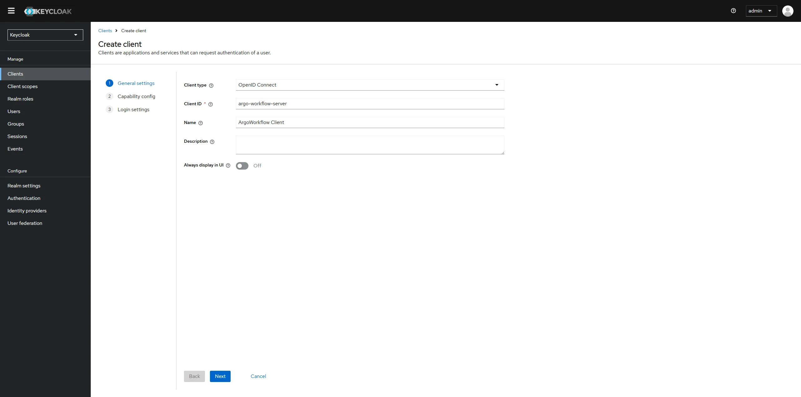

Enable the **Client authentication**.  
 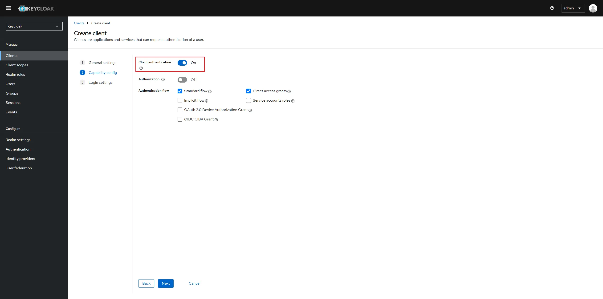

Configure the client by setting the **Root URL**, **Web origins**, **Admin URL** to the hostname (https://{hostname}).

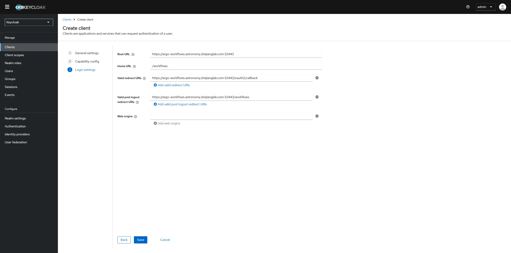

Make sure to click **Save**.

## Configure the groups claim
In order for ArgoWorkflow to provide the groups the user is in we need to configure a groups claim that can be included in the authentication token.

To do this we'll start by creating a new **Client Scope** called _groups_.

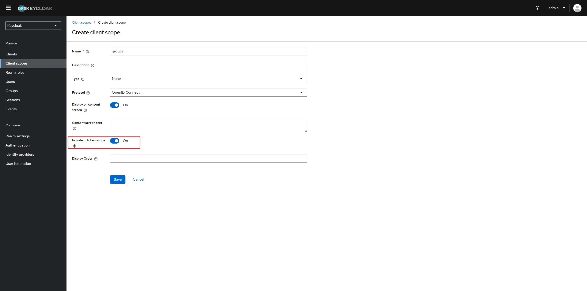

Once you've created the client scope you can now add a Token Mapper which will add the groups claim to the token when the client requests the groups scope.

In the Tab "Mappers", click on "Configure a new mapper" and choose **Group Membership**.

Make sure to set the **Name** as well as the **Token Claim Name** to _groups_. Also disable the "Full group path".

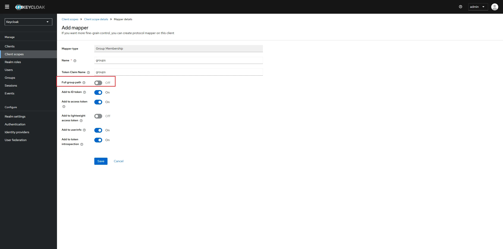

## Configure the client to provide the _groups_ scope

Go back to the client we've created earlier and go to the Tab "Client Scopes".

Click on "Add client scope", choose the _groups_ scope and add it either to the **Default** or to the **Optional** Client Scope.

If you put it in the Optional category you will need to make sure that ArgoCD requests the scope in its OIDC configuration. Since we will always want group information, I recommend using the Default category.

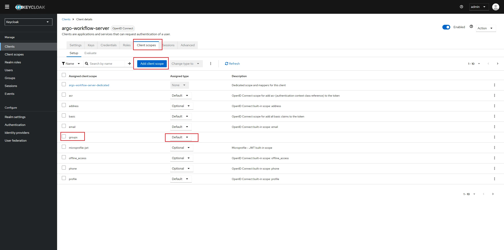

## Install Argoworkflow with SSO
Copy the client-id and client-secret of argo-workflow-server.

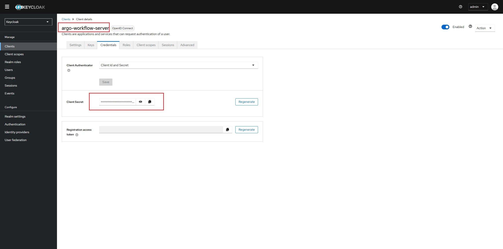

Create secrets to store client  credentials.

```bash
kubectl create secret -n workflows generic client-id-secret \
  --from-literal=client-id-key=argo-workflow-server

kubectl create secret -n workflows generic client-secret-secret \
  --from-literal=client-secret-key=BYvl***wQtq3
```

Prepare `workflow-sso.yaml`

```yaml title="workflow-sso.yaml"
---
apiVersion: argoproj.io/v1alpha1
kind: Application
metadata:
  name: argo-workflows
spec:
  syncPolicy:
    syncOptions:
    - CreateNamespace=true
  project: default
  source:
    repoURL: https://argoproj.github.io/argo-helm
    chart: argo-workflows
    targetRevision: 0.40.11
    helm:
      releaseName: argo-workflows
      values: |
        crds:
          install: true
          keep: false
        singleNamespace: false
        controller:
          image:
            registry: m.lab.zverse.space/quay.io
        executor:
          image:
            registry: m.lab.zverse.space/quay.io
        workflow:
          serviceAccount:
            create: true
          rbac:
            create: true
        server:
          enabled: true
          image:
            registry: m.lab.zverse.space/quay.io
          ingress:
            enabled: true
            ingressClassName: nginx
            annotations:
              cert-manager.io/cluster-issuer: self-signed-ca-issuer
              nginx.ingress.kubernetes.io/rewrite-target: /$1
            hosts:
              - argo-workflows.astronomy.zhejianglab.com
            paths:
              - /?(.*)
            tls:
              - secretName: argo-workflows-tls
                hosts:
                  - argo-workflows.astronomy.zhejianglab.com
          authModes:
            - sso
          hostAliases:
            - ip: 192.168.49.2
              hostnames:
                - "keycloak.astronomy.zhejianglab.com"
          sso:
            enabled: true
            issuer: https://keycloak.astronomy.zhejianglab.com:32443/realms/master
            sessionExpiry: 4h
            insecureSkipVerify: true
            clientId:
              name: client-id-secret
              key: client-id-key
            clientSecret:
              name: client-secret-secret
              key: client-secret-key
            redirectUrl: https://argo-workflows.astronomy.zhejianglab.com:32443/oauth2/callback
            rbac:
              enabled: true
            scopes:
              - groups
              - email
              - profile
  destination:
    server: https://kubernetes.default.svc
    namespace: workflows
```

Apply

```bash
 kubectl apply -f workflow-sso.yaml -n argocd
 argocd app sync argocd/argo-workflows
 argocd app wait argocd/argo-workflows
```

## Login Argoworkflow and enable rbac
There we will create a user that has readonly access to workflow.

### Create a group named "ArgoViewer" In Keycloak
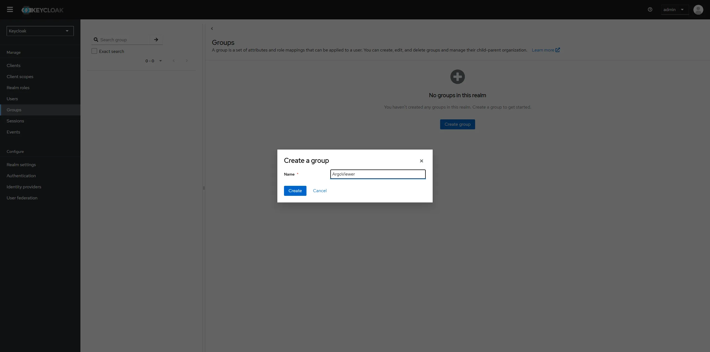

### Create a user named "viewer001" In Keycloak
Let the viewer001 join group of ArgoViewer.

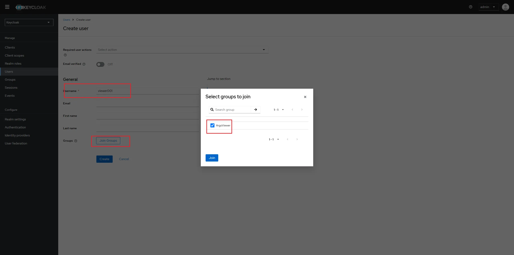

Click the tab "credential" to set initial password for viewer001.

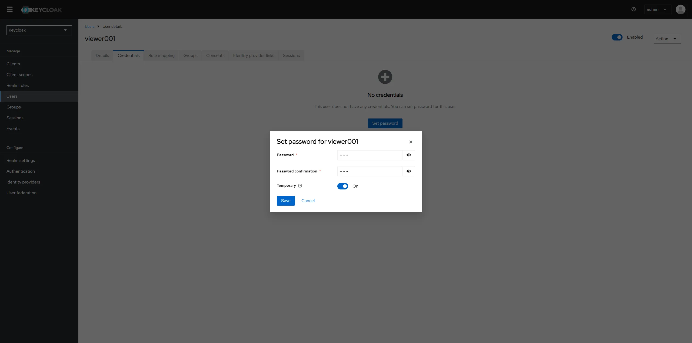

### Create a SA named "argo-viewer" in k8s
```bash
apply -f argo-viewer.yaml -n workflows
```

```yaml title="argo-viewer.yaml"
apiVersion: v1
kind: ServiceAccount
metadata:
  name: argo-viewer
  annotations:
    workflows.argoproj.io/rbac-rule: "'ArgoViewer' in groups"
    workflows.argoproj.io/rbac-rule-precedence: "1"
secrets:
- name: argo-viewer-token
---
apiVersion: v1
kind: Secret
metadata:
  name: argo-viewer-token
  annotations:
    kubernetes.io/service-account.name: argo-viewer
type: kubernetes.io/service-account-token

---
apiVersion: rbac.authorization.k8s.io/v1
kind: Role
metadata:
  name: argo-viewer-role
rules:
- apiGroups: ["argoproj.io"]
  resources: ["workflows", "workflowtemplates", "cronworkflows", "clusterworkflowtemplates"]
  verbs: ["get", "list", "watch"]

---
apiVersion: rbac.authorization.k8s.io/v1
kind: RoleBinding
metadata:
  name: argo-viewer-binding
roleRef:
  apiGroup: rbac.authorization.k8s.io
  kind: Role
  name: argo-viewer-role
subjects:
- kind: ServiceAccount
  name: argo-viewer
```

### Test login and permission
Browsing [https://argo-workflows.astronomy.zhejianglab.com:32443/](https://argo-workflows.astronomy.zhejianglab.com:32443/), there will switch to login page autolly, click login button under single sign-on.

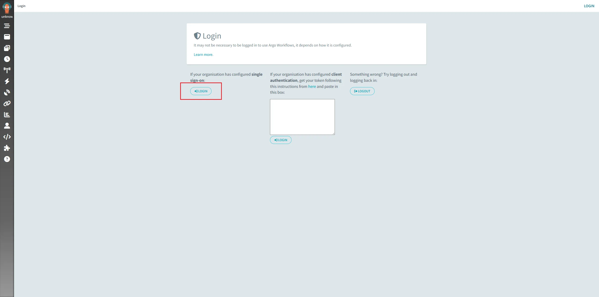

Then, there redirect to keycloak login page autolly. Login with viewer001.

Login at first time, it is need to update password.

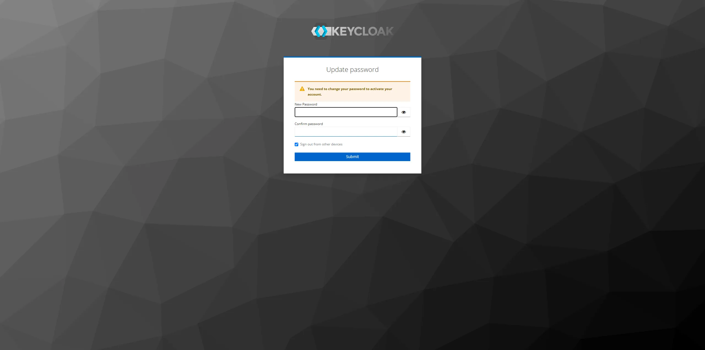

Then, Login succeed. There redirect to argo workflow page autolly.

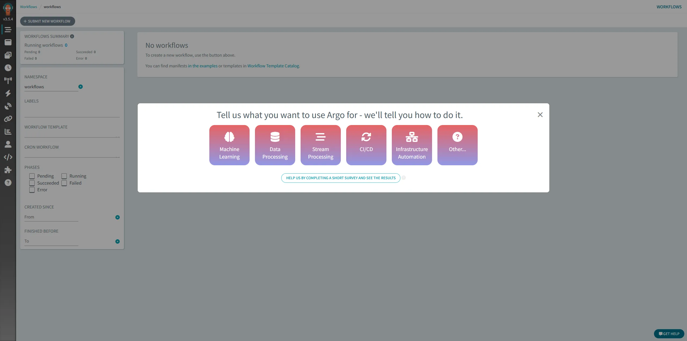

And we can see the rbac is worked.

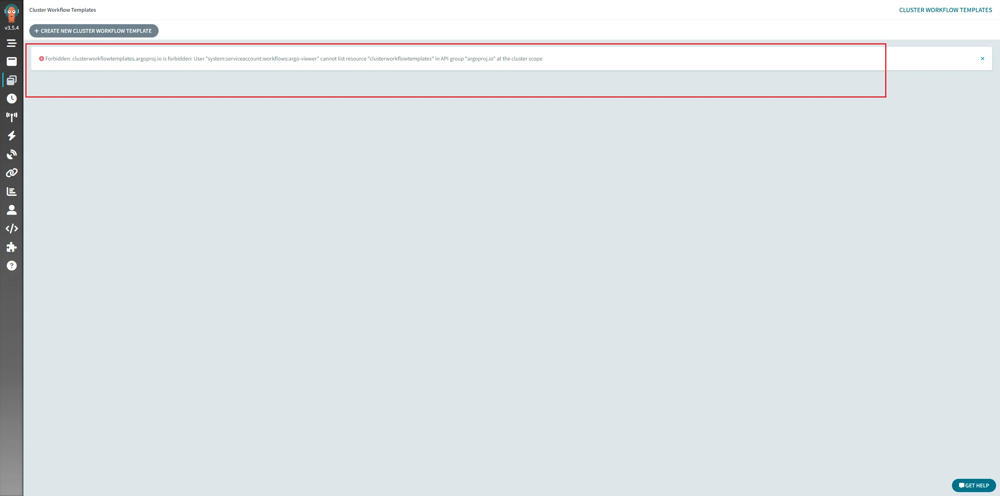

## Using github account
Register a new OAuth app in github. [https://github.com/settings/applications/new](https://github.com/settings/applications/new)

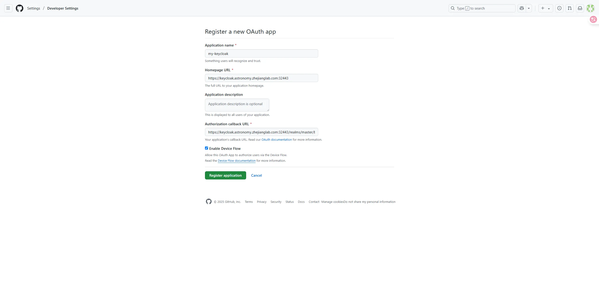

Then, we can get a pair of Client ID and Client secrets, copy it.

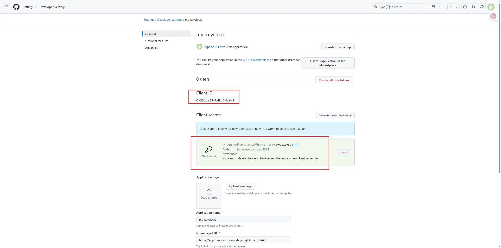

Click the tab "Identity providers" at the left sidebar to create new one of github.

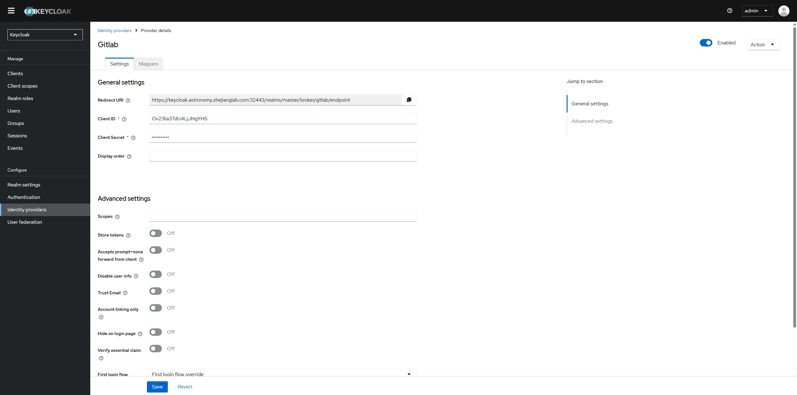

In order to give group to users loged from github, click tab "mapper" and creat a new mapper.

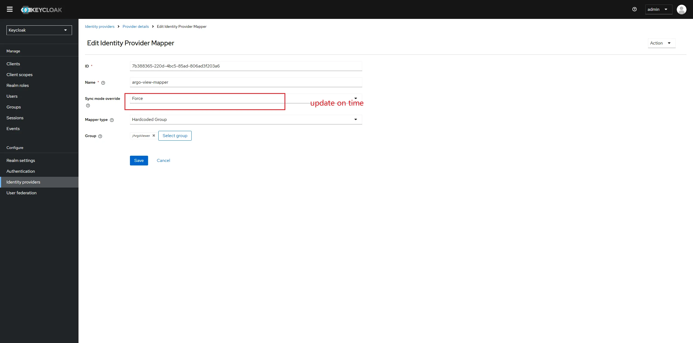

Try to log in argo workflow, there is a new button in the login page of Keycloak.

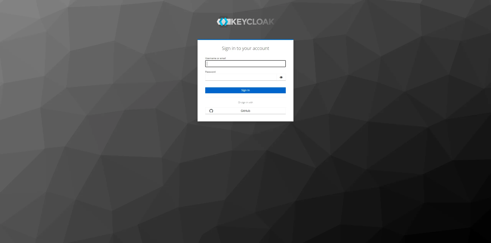

Click "GitHub" to log in. It will work. And the group of user is also binded sucessfully.

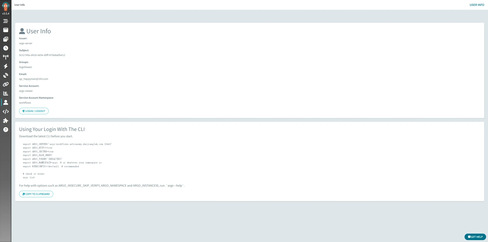


## <font style="color:#DF2A3F;">TODO:  how to map different github account to different groups.
