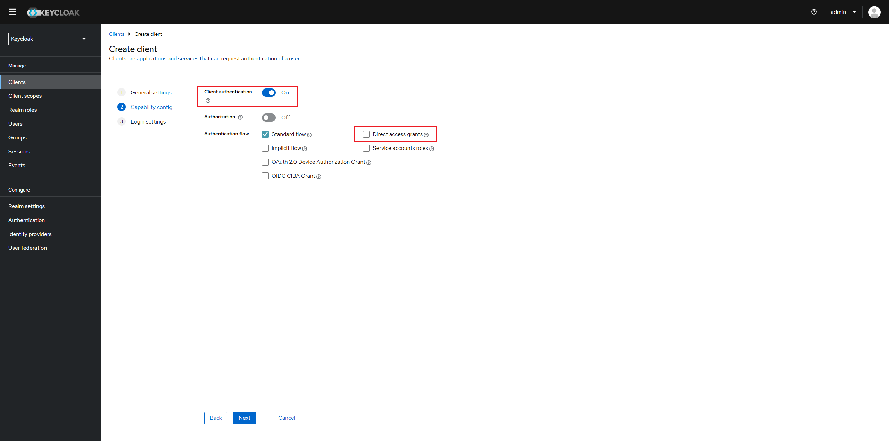
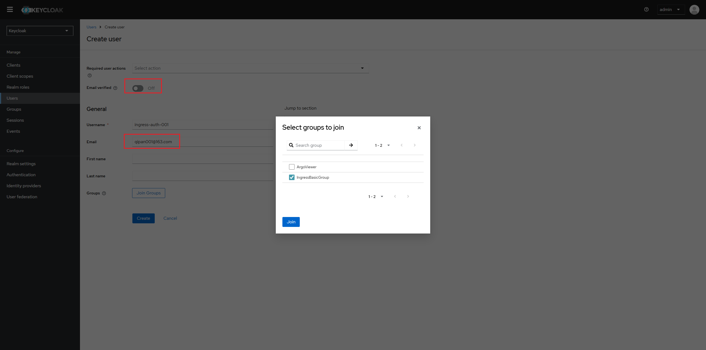

## Precontidions
1. [Install the keycloak](/docs/notes/others/Keycloak/Install)


## Prepare a KeyCloak client and user
1. Refer [Configure the groups claim](/docs/notes/others/Keycloak/ArgoWorkflow%20SSO%20on%20Keycloak#Configure-the-groups-claim) to configure a groups claim if there is no groups claim in Keycloak.

2. Setup a new client in Keycloak for Oauth2-proxy.
    
    
    
3. Configure the client to provide the _groups_ scope.
    

4. Create a group "IngressBasicGroup".
    

5. Create a test account "ingress-auth-001"
    :::danger
    1. Email authentication is mandatory for OAuth2-Proxy, so this field is required. Otherwise, authentication will fail with the following error message in OAuth2-Proxy pod.  
        `Error creating session during OAuth2 callback: could not enrich oidc session: neither the id_token nor the profileURL set an email`  
    2. Either enable **Email verified** when creating the user, or inclued the arg **--insecure-oidc-allow-unverified-email=true**  when [Installing Oauth2-Proxy](#Install-OAuth2-Proxy).Otherwise, authentication will fail with the following error message in OAuth2-Proxy pod.   
        `Error redeeming code during OAuth2 callback: email in id_token (qipan001@163.com) isn't verified`
    :::
    
    Click the tab "credential" to set initial password for user.
    
    :::danger
    Users created in keycloak have a default role "default-roles-master". It must be **unassigned**.  
    Otherwise, authentication will fail with the following error message in OAuth2-Proxy pod.  
    `WARNING: Multiple cookies are required for this session as it exceeds the 4kb cookie limit. Please use server side session storage (eg. Redis) instead.`
    :::
    


## Install OAuth2 Proxy
1. Generate a strong cookie secret
    ```bash
    dd if=/dev/urandom bs=32 count=1 2>/dev/null | base64 | tr -d -- '\n' | tr -- '+/' '-_' ; echo
    ```

2. Prepare `oauth2-proxy.yaml`
    ```yaml title="oauth2-proxy.yaml"
    apiVersion: apps/v1
    kind: Deployment
    metadata:
    labels:
        k8s-app: oauth2-proxy
    name: oauth2-proxy
    spec:
    replicas: 1
    selector:
        matchLabels:
        k8s-app: oauth2-proxy
    template:
        metadata:
        labels:
            k8s-app: oauth2-proxy
        spec:
        hostAliases:
        - ip: "192.168.49.2"
            hostnames:
            - "keycloak.astronomy.zhejianglab.com"
            - "oauth2-proxy.astronomy.zhejianglab.com"
        containers:
        - name: oauth2-proxy
            imagePullPolicy: Always
            image: quay.io/oauth2-proxy/oauth2-proxy:latest
            args:
            - --http-address=0.0.0.0:4180
            - --reverse-proxy=true
            - --provider=keycloak-oidc
            - --client-id=ingress-basic-client
            - --client-secret=tjGSEuo7hH9IJZsPmIzXIlzPegzC6c4a
            - --cookie-secret=_gcRgjMaKeuOV-V3DS78wFLW0YAaSDR1nDPhqMFvQvo=
            - --redirect-url=https://oauth2-proxy.astronomy.zhejianglab.com:32443/oauth2/callback
            - --oidc-issuer-url=https://keycloak.astronomy.zhejianglab.com:32443/realms/master
            - --email-domain=*
            - --allowed-group=IngressBasicGroup
            - --scope=openid profile email groups
            - --insecure-oidc-allow-unverified-email=true
            - --code-challenge-method=S256
            - --session-store-type=cookie
            - --cookie-csrf-per-request=true
            - --cookie-csrf-expire=5m
            - --cookie-refresh=5m
            - --cookie-samesite=none
            - --cookie-secure=true
            - --pass-access-token=true
            - --pass-authorization-header=true
            - --set-authorization-header=true
            - --set-xauthrequest=true
            - --skip-auth-preflight=false
            - --ssl-insecure-skip-verify=true
            - --whitelist-domain=oauth2-proxy.astronomy.zhejianglab.com:32443
            ports:
            - containerPort: 4180
            protocol: TCP


    ---

    apiVersion: v1
    kind: Service
    metadata:
    labels:
        k8s-app: oauth2-proxy
    name: oauth2-proxy
    spec:
    ports:
    - name: http
        port: 4180
        protocol: TCP
        targetPort: 4180
    selector:
        k8s-app: oauth2-proxy

    ---

    apiVersion: networking.k8s.io/v1
    kind: Ingress
    metadata:
    name: oauth2-proxy
    annotations:
        cert-manager.io/cluster-issuer: self-signed-ca-issuer
    spec:
    ingressClassName: nginx
    rules:
    - host: oauth2-proxy.astronomy.zhejianglab.com
        http:
        paths:
        - path: /oauth2
            pathType: Prefix
            backend:
            service:
                name: oauth2-proxy
                port:
                number: 4180
    tls:
    - hosts:
        - oauth2-proxy.astronomy.zhejianglab.com
        secretName: oauth2-proxy.astronomy.zhejianglab.com-tls
    ```

3. Apply
    ```bash
    kubectl -n basic-components apply -f oauth2-proxy.yaml
    ```


## Create a service for authentication test
1. Prepare `httpbin.yaml`
    ```yaml title="httpbin.yaml"
    apiVersion: apps/v1
    kind: Deployment
    metadata:
    name: httpbin
    namespace: basic-components
    spec:
    replicas: 1
    selector:
        matchLabels:
        app: httpbin
    template:
        metadata:
        labels:
            app: httpbin
        spec:
        containers:
        - name: httpbin
            image: m.lab.zverse.space/docker.io/kennethreitz/httpbin
            ports:
            - containerPort: 80

    ---

    apiVersion: v1
    kind: Service
    metadata:
    name: httpbin
    namespace: basic-components
    spec:
    selector:
        app: httpbin
    ports:
    - name: http
        port: 80
        targetPort: 80

    ---

    apiVersion: networking.k8s.io/v1
    kind: Ingress
    metadata:
    name: httpbin-ingress
    namespace: basic-components
    annotations:
        cert-manager.io/cluster-issuer: self-signed-ca-issuer
        nginx.ingress.kubernetes.io/auth-url: "http://oauth2-proxy.basic-components.svc.cluster.local:4180/oauth2/auth"
        nginx.ingress.kubernetes.io/auth-signin: "https://oauth2-proxy.astronomy.zhejianglab.com:32443/oauth2/start?rd=$escaped_request_uri"
    spec:
    ingressClassName: nginx
    rules:
    - host: httpbin-test.astronomy.zhejianglab.com
        http:
        paths:
        - path: /
            pathType: Prefix
            backend:
            service:
                name: httpbin
                port:
                number: 80
    tls:
    - hosts:
        - httpbin-test.astronomy.zhejianglab.com
        secretName: httpbin-test.astronomy.zhejianglab.com-tls
    ```
2. Apply
    ```bash
    kubectl -n basic-components apply -f httpbin.yaml
    ```

## Test
The initial authentication flow works correctly:

Accessing the protected application URL [https://httpbin-test.astronomy.zhejianglab.com:32443](https://httpbin-test.astronomy.zhejianglab.com:32443) correctly redirects to oauth2-proxy.  

oauth2-proxy correctly redirects to the Keycloak login page.  

I can log in with a valid user in Keycloak.  

Keycloak successfully authenticates and redirects back to the oauth2-proxy /oauth2/callback URL.  

The failure occurs at the callback step. The oauth2-proxy logs show a successful authentication ([AuthSuccess]), but it's immediately followed by an `AuthFailure error: unable to obtain CSRF cookie`.  

This ultimately results in the browser being redirected to the root of the oauth2-proxy service (/), which returns a 404 Not Found because my Ingress for the proxy only handles the /oauth2 path.  


According to OAuth2-proxy Source Code, the **cookie in Callback Request is empty**. The callback request in browser had the oauth2_proxy cookie(see the sixth image at https://github.com/oauth2-proxy/oauth2-proxy/issues/3124), so the cookie must be lost in the middle of the process. 

```go title="OAuth2-proxy Source Code"
func (p *OAuthProxy) OAuthCallback(rw http.ResponseWriter, req *http.Request) {
	remoteAddr := ip.GetClientString(p.realClientIPParser, req, true)

	// finish the oauth cycle
	err := req.ParseForm()
	if err != nil {
		logger.Errorf("Error while parsing OAuth2 callback: %v", err)
		p.ErrorPage(rw, req, http.StatusInternalServerError, err.Error())
		return
	}
	errorString := req.Form.Get("error")
	if errorString != "" {
		logger.Errorf("Error while parsing OAuth2 callback: %s", errorString)
		message := fmt.Sprintf("Login Failed: The upstream identity provider returned an error: %s", errorString)
		// Set the debug message and override the non debug message to be the same for this case
		p.ErrorPage(rw, req, http.StatusForbidden, message, message)
		return
	}

	nonce, appRedirect, err := decodeState(req.Form.Get("state"), p.encodeState)
	if err != nil {
		logger.Errorf("Error while parsing OAuth2 state: %v", err)
		p.ErrorPage(rw, req, http.StatusInternalServerError, err.Error())
		return
	}

	// calculate the cookie name
	cookieName := cookies.GenerateCookieName(p.CookieOptions, nonce)
	// Try to find the CSRF cookie and decode it
	csrf, err := cookies.LoadCSRFCookie(req, cookieName, p.CookieOptions)
	if err != nil {
		// There are a lot of issues opened complaining about missing CSRF cookies.
		// Try to log the INs and OUTs of OAuthProxy, to be easier to analyse these issues.
		LoggingCSRFCookiesInOAuthCallback(req, cookieName)
		logger.Println(req, logger.AuthFailure, "Invalid authentication via OAuth2: unable to obtain CSRF cookie: %s (state=%s)", err, nonce)
		p.ErrorPage(rw, req, http.StatusForbidden, err.Error(), "Login Failed: Unable to find a valid CSRF token. Please try again.")
		return
	}
    ...
}
// LoggingCSRFCookiesInOAuthCallback Log all CSRF cookies found in HTTP request OAuth callback,
// which were successfully parsed
func LoggingCSRFCookiesInOAuthCallback(req *http.Request, cookieName string) {
	cookies := req.Cookies()
	if len(cookies) == 0 {
		logger.Println(req, logger.AuthFailure, "No cookies were found in OAuth callback.")
		return
	}

	for _, c := range cookies {
		if cookieName == c.Name {
			logger.Println(req, logger.AuthFailure, "CSRF cookie %s was found in OAuth callback.", c.Name)
			return
		}

		if strings.HasSuffix(c.Name, "_csrf") {
			logger.Println(req, logger.AuthFailure, "CSRF cookie %s was found in OAuth callback, but it is not the expected one (%s).", c.Name, cookieName)
			return
		}
	}

	logger.Println(req, logger.AuthFailure, "Cookies were found in OAuth callback, but none was a CSRF cookie.")
}
```

## Reference
1. [Ingress_Nginx External OAUTH](https://kubernetes.github.io/ingress-nginx/examples/auth/oauth-external-auth/)
2. [ingess-nginx-oauth2-proxy.yaml: a demo of auth via github](https://raw.githubusercontent.com/kubernetes/ingress-nginx/main/docs/examples/auth/oauth-external-auth/oauth2-proxy.yaml)
3. [Keycloak OIDC as OAuth provider of OAuth2 Proxy](https://oauth2-proxy.github.io/oauth2-proxy/configuration/providers/keycloak_oidc)