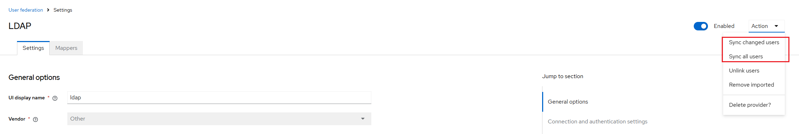

## Precontidions
1. [Install the OpenLDAP](/docs/notes/others/openldap/Install)

## Config the LDAP User Provider
1. Click the tab `User federation` and the button `Add new provider` to add a new LDAP provider
    
    
    
2. Sync user to LDAP server. Auto `full sync` and `periodic changed users sync` can be set, or you can syncing user manually.
    
    