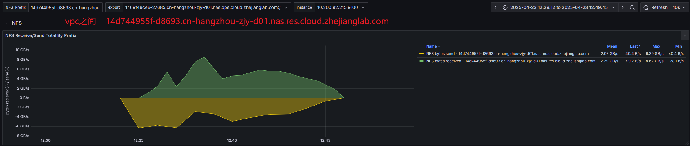

## Create a workflow
```yml
apiVersion: argoproj.io/v1alpha1
kind: Workflow
metadata:
  generateName: nfs-performance-test-
spec:
  serviceAccountName: argo-workflow
  entrypoint: main
  arguments:
    parameters:
    - name: nfs-server
      value: 14d744955f-d8693.cn-hangzhou-zjy-d01.nas.res.cloud.zhejianglab.com
    - name: nfs-path
      value: /lensing-download
    - name: test-dirs-count
      value: "200"

  volumes:
  - name: nfs-volume
    nfs:
      server: "{{workflow.parameters.nfs-server}}"
      path: "{{workflow.parameters.nfs-path}}"
      readOnly: false

  templates:
  - name: main
    dag:
      tasks:
      - name: create-test-dirs
        template: create-directories

      - name: parallel-tests
        template: test-nfs
        depends: create-test-dirs
        arguments:
          parameters:
          - name: index
            value: "{{item}}"
        withParam: "{{tasks.create-test-dirs.outputs.result}}"
      - name: cleanup
        template: delete-directories
        depends: "parallel-tests.Succeeded || parallel-tests.Failed"
  - name: create-directories
    script:
      image: m.lab.zverse.space/docker.io/alpine:3.19
      command: [sh]
      source: |
        #!/bin/sh
        for i in $(seq 1 {{workflow.parameters.test-dirs-count}})
        do
          mkdir -p /mnt/nfs/test/test-dir-$i
        done
        echo "[$(seq -s, 1 {{workflow.parameters.test-dirs-count}})]"
      volumeMounts:
      - name: nfs-volume
        mountPath: /mnt/nfs

  - name: test-nfs
    inputs:
      parameters:
      - name: index
    container:
      image: m.lab.zverse.space/docker.io/alpine:3.19
      resources:
        requests:
          memory: "512Mi"
          cpu: "500m"
      command: [sh, -c]
      args:
      - |
        echo "Starting test for directory test-dir-{{inputs.parameters.index}}"
        dd if=/dev/urandom of=/test/data/testfile bs=128M count=75 oflag=direct
        sync
        echo "\nReading test file..."
        dd if=/test/data/testfile of=/dev/null bs=128M iflag=direct
        echo "\nVerifying file size..."
        ls -lh /test/data/testfile
        rm -f /test/data/testfile
        dd if=/dev/urandom of=/test/data/testfile bs=128M count=75 oflag=direct
        sync
        echo "\nReading test file..."
        dd if=/test/data/testfile of=/dev/null bs=128M iflag=direct
        echo "\nVerifying file size..."
        echo "\nTest completed for test-dir-{{inputs.parameters.index}}"
      volumeMounts:
      - name: nfs-volume
        mountPath: /test/data
        subPath: test/test-dir-{{inputs.parameters.index}}

  - name: delete-directories
    script:
      image: m.lab.zverse.space/docker.io/alpine:3.19
      command: [sh]
      source: |
        #!/bin/sh
        for i in $(seq 1 {{workflow.parameters.test-dirs-count}})
        do
          rm -rf /mnt/nfs/test
          echo "Deleted directory: /mnt/nfs/test"
        done
      volumeMounts:
      - name: nfs-volume
        mountPath: /mnt/nfs
```

## Create a grafana dashboard to check nfs performance


```json title="dashboard.json"
{
  "annotations": {
    "list": [
      {
        "builtIn": 1,
        "datasource": {
          "type": "prometheus",
          "uid": "prometheus"
        },
        "enable": true,
        "hide": true,
        "iconColor": "rgba(0, 211, 255, 1)",
        "limit": 100,
        "name": "Annotations & Alerts",
        "showIn": 0,
        "type": "dashboard"
      }
    ]
  },
  "description": "NFS mountstats monitor for prometheus-node-exporter",
  "editable": true,
  "fiscalYearStartMonth": 0,
  "graphTooltip": 0,
  "id": 47,
  "links": [],
  "panels": [
    {
      "collapsed": false,
      "gridPos": {
        "h": 1,
        "w": 24,
        "x": 0,
        "y": 0
      },
      "id": 274,
      "panels": [],
      "title": "NFS",
      "type": "row"
    },
    {
      "datasource": {
        "type": "prometheus",
        "uid": "prometheus"
      },
      "fieldConfig": {
        "defaults": {
          "color": {
            "mode": "palette-classic"
          },
          "custom": {
            "axisBorderShow": false,
            "axisCenteredZero": false,
            "axisColorMode": "text",
            "axisLabel": "Bytes recieved(-) / send(+)",
            "axisPlacement": "auto",
            "barAlignment": 0,
            "barWidthFactor": 0.6,
            "drawStyle": "line",
            "fillOpacity": 40,
            "gradientMode": "none",
            "hideFrom": {
              "legend": false,
              "tooltip": false,
              "viz": false
            },
            "insertNulls": false,
            "lineInterpolation": "linear",
            "lineWidth": 1,
            "pointSize": 5,
            "scaleDistribution": {
              "type": "linear"
            },
            "showPoints": "never",
            "spanNulls": false,
            "stacking": {
              "group": "A",
              "mode": "none"
            },
            "thresholdsStyle": {
              "mode": "off"
            }
          },
          "mappings": [],
          "thresholds": {
            "mode": "absolute",
            "steps": [
              {
                "color": "green",
                "value": null
              },
              {
                "color": "red",
                "value": 80
              }
            ]
          },
          "unit": "Bps"
        },
        "overrides": [
          {
            "matcher": {
              "id": "byName",
              "options": "receive_packets_eth0"
            },
            "properties": [
              {
                "id": "color",
                "value": {
                  "fixedColor": "#7EB26D",
                  "mode": "fixed"
                }
              }
            ]
          },
          {
            "matcher": {
              "id": "byName",
              "options": "receive_packets_lo"
            },
            "properties": [
              {
                "id": "color",
                "value": {
                  "fixedColor": "#E24D42",
                  "mode": "fixed"
                }
              }
            ]
          },
          {
            "matcher": {
              "id": "byName",
              "options": "transmit_packets_eth0"
            },
            "properties": [
              {
                "id": "color",
                "value": {
                  "fixedColor": "#7EB26D",
                  "mode": "fixed"
                }
              }
            ]
          },
          {
            "matcher": {
              "id": "byName",
              "options": "transmit_packets_lo"
            },
            "properties": [
              {
                "id": "color",
                "value": {
                  "fixedColor": "#E24D42",
                  "mode": "fixed"
                }
              }
            ]
          },
          {
            "matcher": {
              "id": "byRegexp",
              "options": "/.*send.*/"
            },
            "properties": [
              {
                "id": "custom.transform",
                "value": "negative-Y"
              }
            ]
          },
          {
            "matcher": {
              "id": "byName",
              "options": "receive_packets_eth0"
            },
            "properties": [
              {
                "id": "color",
                "value": {
                  "fixedColor": "#7EB26D",
                  "mode": "fixed"
                }
              }
            ]
          },
          {
            "matcher": {
              "id": "byName",
              "options": "receive_packets_lo"
            },
            "properties": [
              {
                "id": "color",
                "value": {
                  "fixedColor": "#E24D42",
                  "mode": "fixed"
                }
              }
            ]
          },
          {
            "matcher": {
              "id": "byName",
              "options": "transmit_packets_eth0"
            },
            "properties": [
              {
                "id": "color",
                "value": {
                  "fixedColor": "#7EB26D",
                  "mode": "fixed"
                }
              }
            ]
          },
          {
            "matcher": {
              "id": "byName",
              "options": "transmit_packets_lo"
            },
            "properties": [
              {
                "id": "color",
                "value": {
                  "fixedColor": "#E24D42",
                  "mode": "fixed"
                }
              }
            ]
          },
          {
            "matcher": {
              "id": "byRegexp",
              "options": "/.*send.*/"
            },
            "properties": [
              {
                "id": "custom.transform",
                "value": "negative-Y"
              }
            ]
          },
          {
            "matcher": {
              "id": "byName",
              "options": "receive_packets_eth0"
            },
            "properties": [
              {
                "id": "color",
                "value": {
                  "fixedColor": "#7EB26D",
                  "mode": "fixed"
                }
              }
            ]
          },
          {
            "matcher": {
              "id": "byName",
              "options": "receive_packets_lo"
            },
            "properties": [
              {
                "id": "color",
                "value": {
                  "fixedColor": "#E24D42",
                  "mode": "fixed"
                }
              }
            ]
          },
          {
            "matcher": {
              "id": "byName",
              "options": "transmit_packets_eth0"
            },
            "properties": [
              {
                "id": "color",
                "value": {
                  "fixedColor": "#7EB26D",
                  "mode": "fixed"
                }
              }
            ]
          },
          {
            "matcher": {
              "id": "byName",
              "options": "transmit_packets_lo"
            },
            "properties": [
              {
                "id": "color",
                "value": {
                  "fixedColor": "#E24D42",
                  "mode": "fixed"
                }
              }
            ]
          },
          {
            "matcher": {
              "id": "byRegexp",
              "options": "/.*send.*/"
            },
            "properties": [
              {
                "id": "custom.transform",
                "value": "negative-Y"
              }
            ]
          },
          {
            "matcher": {
              "id": "byName",
              "options": "receive_packets_eth0"
            },
            "properties": [
              {
                "id": "color",
                "value": {
                  "fixedColor": "#7EB26D",
                  "mode": "fixed"
                }
              }
            ]
          },
          {
            "matcher": {
              "id": "byName",
              "options": "receive_packets_lo"
            },
            "properties": [
              {
                "id": "color",
                "value": {
                  "fixedColor": "#E24D42",
                  "mode": "fixed"
                }
              }
            ]
          },
          {
            "matcher": {
              "id": "byName",
              "options": "transmit_packets_eth0"
            },
            "properties": [
              {
                "id": "color",
                "value": {
                  "fixedColor": "#7EB26D",
                  "mode": "fixed"
                }
              }
            ]
          },
          {
            "matcher": {
              "id": "byName",
              "options": "transmit_packets_lo"
            },
            "properties": [
              {
                "id": "color",
                "value": {
                  "fixedColor": "#E24D42",
                  "mode": "fixed"
                }
              }
            ]
          },
          {
            "matcher": {
              "id": "byRegexp",
              "options": "/.*send.*/"
            },
            "properties": [
              {
                "id": "custom.transform",
                "value": "negative-Y"
              }
            ]
          }
        ]
      },
      "gridPos": {
        "h": 10,
        "w": 24,
        "x": 0,
        "y": 1
      },
      "id": 280,
      "options": {
        "legend": {
          "calcs": [
            "mean",
            "lastNotNull",
            "max",
            "min"
          ],
          "displayMode": "table",
          "placement": "right",
          "showLegend": true,
          "sortBy": "Name",
          "sortDesc": true
        },
        "tooltip": {
          "mode": "multi",
          "sort": "none"
        }
      },
      "pluginVersion": "11.4.0",
      "targets": [
        {
          "datasource": {
            "type": "prometheus",
            "uid": "prometheus"
          },
          "editorMode": "code",
          "expr": "sum(irate(node_mountstats_nfs_operations_received_bytes_total{export=~\"$NFS_Prefix.*\"}[5m]))",
          "format": "time_series",
          "interval": "",
          "intervalFactor": 2,
          "legendFormat": "NFS bytes received - $NFS_Prefix",
          "range": true,
          "refId": "O",
          "step": 240
        },
        {
          "datasource": {
            "type": "prometheus",
            "uid": "prometheus"
          },
          "editorMode": "code",
          "expr": "sum(irate(node_mountstats_nfs_operations_sent_bytes_total{export=~\"$NFS_Prefix.*\"}[5m]))",
          "format": "time_series",
          "intervalFactor": 2,
          "legendFormat": "NFS bytes send - $NFS_Prefix",
          "range": true,
          "refId": "A",
          "step": 240
        }
      ],
      "title": "NFS Receive/Send Total By Prefix",
      "type": "timeseries"
    },
    {
      "datasource": {
        "type": "prometheus",
        "uid": "prometheus"
      },
      "fieldConfig": {
        "defaults": {
          "color": {
            "mode": "palette-classic"
          },
          "custom": {
            "axisBorderShow": false,
            "axisCenteredZero": false,
            "axisColorMode": "text",
            "axisLabel": "Bytes recieved(-) / send(+)",
            "axisPlacement": "auto",
            "barAlignment": 0,
            "barWidthFactor": 0.6,
            "drawStyle": "line",
            "fillOpacity": 40,
            "gradientMode": "none",
            "hideFrom": {
              "legend": false,
              "tooltip": false,
              "viz": false
            },
            "insertNulls": false,
            "lineInterpolation": "linear",
            "lineWidth": 1,
            "pointSize": 5,
            "scaleDistribution": {
              "type": "linear"
            },
            "showPoints": "never",
            "spanNulls": false,
            "stacking": {
              "group": "A",
              "mode": "none"
            },
            "thresholdsStyle": {
              "mode": "off"
            }
          },
          "mappings": [],
          "thresholds": {
            "mode": "absolute",
            "steps": [
              {
                "color": "green",
                "value": null
              },
              {
                "color": "red",
                "value": 80
              }
            ]
          },
          "unit": "Bps"
        },
        "overrides": [
          {
            "matcher": {
              "id": "byName",
              "options": "receive_packets_eth0"
            },
            "properties": [
              {
                "id": "color",
                "value": {
                  "fixedColor": "#7EB26D",
                  "mode": "fixed"
                }
              }
            ]
          },
          {
            "matcher": {
              "id": "byName",
              "options": "receive_packets_lo"
            },
            "properties": [
              {
                "id": "color",
                "value": {
                  "fixedColor": "#E24D42",
                  "mode": "fixed"
                }
              }
            ]
          },
          {
            "matcher": {
              "id": "byName",
              "options": "transmit_packets_eth0"
            },
            "properties": [
              {
                "id": "color",
                "value": {
                  "fixedColor": "#7EB26D",
                  "mode": "fixed"
                }
              }
            ]
          },
          {
            "matcher": {
              "id": "byName",
              "options": "transmit_packets_lo"
            },
            "properties": [
              {
                "id": "color",
                "value": {
                  "fixedColor": "#E24D42",
                  "mode": "fixed"
                }
              }
            ]
          },
          {
            "matcher": {
              "id": "byRegexp",
              "options": "/.*send.*/"
            },
            "properties": [
              {
                "id": "custom.transform",
                "value": "negative-Y"
              }
            ]
          },
          {
            "matcher": {
              "id": "byName",
              "options": "receive_packets_eth0"
            },
            "properties": [
              {
                "id": "color",
                "value": {
                  "fixedColor": "#7EB26D",
                  "mode": "fixed"
                }
              }
            ]
          },
          {
            "matcher": {
              "id": "byName",
              "options": "receive_packets_lo"
            },
            "properties": [
              {
                "id": "color",
                "value": {
                  "fixedColor": "#E24D42",
                  "mode": "fixed"
                }
              }
            ]
          },
          {
            "matcher": {
              "id": "byName",
              "options": "transmit_packets_eth0"
            },
            "properties": [
              {
                "id": "color",
                "value": {
                  "fixedColor": "#7EB26D",
                  "mode": "fixed"
                }
              }
            ]
          },
          {
            "matcher": {
              "id": "byName",
              "options": "transmit_packets_lo"
            },
            "properties": [
              {
                "id": "color",
                "value": {
                  "fixedColor": "#E24D42",
                  "mode": "fixed"
                }
              }
            ]
          },
          {
            "matcher": {
              "id": "byRegexp",
              "options": "/.*send.*/"
            },
            "properties": [
              {
                "id": "custom.transform",
                "value": "negative-Y"
              }
            ]
          },
          {
            "matcher": {
              "id": "byName",
              "options": "receive_packets_eth0"
            },
            "properties": [
              {
                "id": "color",
                "value": {
                  "fixedColor": "#7EB26D",
                  "mode": "fixed"
                }
              }
            ]
          },
          {
            "matcher": {
              "id": "byName",
              "options": "receive_packets_lo"
            },
            "properties": [
              {
                "id": "color",
                "value": {
                  "fixedColor": "#E24D42",
                  "mode": "fixed"
                }
              }
            ]
          },
          {
            "matcher": {
              "id": "byName",
              "options": "transmit_packets_eth0"
            },
            "properties": [
              {
                "id": "color",
                "value": {
                  "fixedColor": "#7EB26D",
                  "mode": "fixed"
                }
              }
            ]
          },
          {
            "matcher": {
              "id": "byName",
              "options": "transmit_packets_lo"
            },
            "properties": [
              {
                "id": "color",
                "value": {
                  "fixedColor": "#E24D42",
                  "mode": "fixed"
                }
              }
            ]
          },
          {
            "matcher": {
              "id": "byRegexp",
              "options": "/.*send.*/"
            },
            "properties": [
              {
                "id": "custom.transform",
                "value": "negative-Y"
              }
            ]
          },
          {
            "matcher": {
              "id": "byName",
              "options": "receive_packets_eth0"
            },
            "properties": [
              {
                "id": "color",
                "value": {
                  "fixedColor": "#7EB26D",
                  "mode": "fixed"
                }
              }
            ]
          },
          {
            "matcher": {
              "id": "byName",
              "options": "receive_packets_lo"
            },
            "properties": [
              {
                "id": "color",
                "value": {
                  "fixedColor": "#E24D42",
                  "mode": "fixed"
                }
              }
            ]
          },
          {
            "matcher": {
              "id": "byName",
              "options": "transmit_packets_eth0"
            },
            "properties": [
              {
                "id": "color",
                "value": {
                  "fixedColor": "#7EB26D",
                  "mode": "fixed"
                }
              }
            ]
          },
          {
            "matcher": {
              "id": "byName",
              "options": "transmit_packets_lo"
            },
            "properties": [
              {
                "id": "color",
                "value": {
                  "fixedColor": "#E24D42",
                  "mode": "fixed"
                }
              }
            ]
          },
          {
            "matcher": {
              "id": "byRegexp",
              "options": "/.*send.*/"
            },
            "properties": [
              {
                "id": "custom.transform",
                "value": "negative-Y"
              }
            ]
          },
          {
            "__systemRef": "hideSeriesFrom",
            "matcher": {
              "id": "byNames",
              "options": {
                "mode": "exclude",
                "names": [
                  "NFS bytes received - nas-nm129-25GE.alkaidos.cn:/si000958a3ec/projects/shao/quacka/data"
                ],
                "prefix": "All except:",
                "readOnly": true
              }
            },
            "properties": [
              {
                "id": "custom.hideFrom",
                "value": {
                  "legend": false,
                  "tooltip": false,
                  "viz": true
                }
              }
            ]
          }
        ]
      },
      "gridPos": {
        "h": 10,
        "w": 24,
        "x": 0,
        "y": 11
      },
      "id": 279,
      "options": {
        "legend": {
          "calcs": [
            "mean",
            "lastNotNull",
            "max",
            "min"
          ],
          "displayMode": "table",
          "placement": "right",
          "showLegend": true
        },
        "tooltip": {
          "mode": "multi",
          "sort": "none"
        }
      },
      "pluginVersion": "11.4.0",
      "targets": [
        {
          "datasource": {
            "type": "prometheus",
            "uid": "prometheus"
          },
          "editorMode": "code",
          "expr": "sum(irate(node_mountstats_nfs_operations_received_bytes_total{export=\"$export\"}[5m]))",
          "format": "time_series",
          "interval": "",
          "intervalFactor": 2,
          "legendFormat": "NFS bytes received - $export",
          "range": true,
          "refId": "O",
          "step": 240
        },
        {
          "datasource": {
            "type": "prometheus",
            "uid": "prometheus"
          },
          "editorMode": "code",
          "expr": "sum(irate(node_mountstats_nfs_operations_sent_bytes_total{export=\"$export\"}[5m]))",
          "format": "time_series",
          "intervalFactor": 2,
          "legendFormat": "NFS bytes send - $export",
          "range": true,
          "refId": "A",
          "step": 240
        }
      ],
      "title": "NFS Receive/Send Total Of One Export",
      "type": "timeseries"
    },
    {
      "datasource": {
        "type": "prometheus",
        "uid": "prometheus"
      },
      "fieldConfig": {
        "defaults": {
          "color": {
            "mode": "palette-classic"
          },
          "custom": {
            "axisBorderShow": false,
            "axisCenteredZero": false,
            "axisColorMode": "text",
            "axisLabel": "Bytes recieved(-) / send(+)",
            "axisPlacement": "auto",
            "barAlignment": 0,
            "barWidthFactor": 0.6,
            "drawStyle": "line",
            "fillOpacity": 40,
            "gradientMode": "none",
            "hideFrom": {
              "legend": false,
              "tooltip": false,
              "viz": false
            },
            "insertNulls": false,
            "lineInterpolation": "linear",
            "lineWidth": 1,
            "pointSize": 5,
            "scaleDistribution": {
              "type": "linear"
            },
            "showPoints": "never",
            "spanNulls": false,
            "stacking": {
              "group": "A",
              "mode": "none"
            },
            "thresholdsStyle": {
              "mode": "off"
            }
          },
          "mappings": [],
          "thresholds": {
            "mode": "absolute",
            "steps": [
              {
                "color": "green",
                "value": null
              },
              {
                "color": "red",
                "value": 80
              }
            ]
          },
          "unit": "Bps"
        },
        "overrides": [
          {
            "matcher": {
              "id": "byName",
              "options": "receive_packets_eth0"
            },
            "properties": [
              {
                "id": "color",
                "value": {
                  "fixedColor": "#7EB26D",
                  "mode": "fixed"
                }
              }
            ]
          },
          {
            "matcher": {
              "id": "byName",
              "options": "receive_packets_lo"
            },
            "properties": [
              {
                "id": "color",
                "value": {
                  "fixedColor": "#E24D42",
                  "mode": "fixed"
                }
              }
            ]
          },
          {
            "matcher": {
              "id": "byName",
              "options": "transmit_packets_eth0"
            },
            "properties": [
              {
                "id": "color",
                "value": {
                  "fixedColor": "#7EB26D",
                  "mode": "fixed"
                }
              }
            ]
          },
          {
            "matcher": {
              "id": "byName",
              "options": "transmit_packets_lo"
            },
            "properties": [
              {
                "id": "color",
                "value": {
                  "fixedColor": "#E24D42",
                  "mode": "fixed"
                }
              }
            ]
          },
          {
            "matcher": {
              "id": "byRegexp",
              "options": "/.*send.*/"
            },
            "properties": [
              {
                "id": "custom.transform",
                "value": "negative-Y"
              }
            ]
          },
          {
            "matcher": {
              "id": "byName",
              "options": "receive_packets_eth0"
            },
            "properties": [
              {
                "id": "color",
                "value": {
                  "fixedColor": "#7EB26D",
                  "mode": "fixed"
                }
              }
            ]
          },
          {
            "matcher": {
              "id": "byName",
              "options": "receive_packets_lo"
            },
            "properties": [
              {
                "id": "color",
                "value": {
                  "fixedColor": "#E24D42",
                  "mode": "fixed"
                }
              }
            ]
          },
          {
            "matcher": {
              "id": "byName",
              "options": "transmit_packets_eth0"
            },
            "properties": [
              {
                "id": "color",
                "value": {
                  "fixedColor": "#7EB26D",
                  "mode": "fixed"
                }
              }
            ]
          },
          {
            "matcher": {
              "id": "byName",
              "options": "transmit_packets_lo"
            },
            "properties": [
              {
                "id": "color",
                "value": {
                  "fixedColor": "#E24D42",
                  "mode": "fixed"
                }
              }
            ]
          },
          {
            "matcher": {
              "id": "byRegexp",
              "options": "/.*send.*/"
            },
            "properties": [
              {
                "id": "custom.transform",
                "value": "negative-Y"
              }
            ]
          },
          {
            "__systemRef": "hideSeriesFrom",
            "matcher": {
              "id": "byNames",
              "options": {
                "mode": "exclude",
                "names": [
                  "NFS bytes received - nas-nm129-25GE.alkaidos.cn:/si000958a3ec/projects/shao/quacka/data"
                ],
                "prefix": "All except:",
                "readOnly": true
              }
            },
            "properties": [
              {
                "id": "custom.hideFrom",
                "value": {
                  "legend": false,
                  "tooltip": false,
                  "viz": true
                }
              }
            ]
          }
        ]
      },
      "gridPos": {
        "h": 10,
        "w": 24,
        "x": 0,
        "y": 21
      },
      "id": 278,
      "options": {
        "legend": {
          "calcs": [
            "mean",
            "lastNotNull",
            "max",
            "min"
          ],
          "displayMode": "table",
          "placement": "right",
          "showLegend": true
        },
        "tooltip": {
          "mode": "multi",
          "sort": "none"
        }
      },
      "pluginVersion": "11.4.0",
      "targets": [
        {
          "datasource": {
            "type": "prometheus",
            "uid": "prometheus"
          },
          "editorMode": "code",
          "expr": "sum(irate(node_mountstats_nfs_operations_received_bytes_total{instance=~\"$instance\"}[5m])) by (export)",
          "format": "time_series",
          "intervalFactor": 2,
          "legendFormat": "NFS bytes received - {{export}}",
          "range": true,
          "refId": "O",
          "step": 240
        },
        {
          "datasource": {
            "type": "prometheus",
            "uid": "prometheus"
          },
          "editorMode": "code",
          "expr": "sum(irate(node_mountstats_nfs_operations_sent_bytes_total{instance=~\"$instance\"}[5m])) by (export)",
          "format": "time_series",
          "intervalFactor": 2,
          "legendFormat": "NFS bytes send - {{export}}",
          "range": true,
          "refId": "A",
          "step": 240
        }
      ],
      "title": "NFS Receive/Send Total",
      "type": "timeseries"
    },
    {
      "datasource": {
        "type": "prometheus",
        "uid": "prometheus"
      },
      "fieldConfig": {
        "defaults": {
          "color": {
            "mode": "palette-classic"
          },
          "custom": {
            "axisBorderShow": false,
            "axisCenteredZero": false,
            "axisColorMode": "text",
            "axisLabel": "Requests",
            "axisPlacement": "auto",
            "barAlignment": 0,
            "barWidthFactor": 0.6,
            "drawStyle": "line",
            "fillOpacity": 40,
            "gradientMode": "none",
            "hideFrom": {
              "legend": false,
              "tooltip": false,
              "viz": false
            },
            "insertNulls": false,
            "lineInterpolation": "linear",
            "lineWidth": 1,
            "pointSize": 5,
            "scaleDistribution": {
              "type": "linear"
            },
            "showPoints": "never",
            "spanNulls": false,
            "stacking": {
              "group": "A",
              "mode": "none"
            },
            "thresholdsStyle": {
              "mode": "off"
            }
          },
          "mappings": [],
          "thresholds": {
            "mode": "absolute",
            "steps": [
              {
                "color": "green",
                "value": null
              },
              {
                "color": "red",
                "value": 80
              }
            ]
          },
          "unit": "reqps"
        },
        "overrides": [
          {
            "matcher": {
              "id": "byName",
              "options": "receive_packets_eth0"
            },
            "properties": [
              {
                "id": "color",
                "value": {
                  "fixedColor": "#7EB26D",
                  "mode": "fixed"
                }
              }
            ]
          },
          {
            "matcher": {
              "id": "byName",
              "options": "receive_packets_lo"
            },
            "properties": [
              {
                "id": "color",
                "value": {
                  "fixedColor": "#E24D42",
                  "mode": "fixed"
                }
              }
            ]
          },
          {
            "matcher": {
              "id": "byName",
              "options": "transmit_packets_eth0"
            },
            "properties": [
              {
                "id": "color",
                "value": {
                  "fixedColor": "#7EB26D",
                  "mode": "fixed"
                }
              }
            ]
          },
          {
            "matcher": {
              "id": "byName",
              "options": "transmit_packets_lo"
            },
            "properties": [
              {
                "id": "color",
                "value": {
                  "fixedColor": "#E24D42",
                  "mode": "fixed"
                }
              }
            ]
          }
        ]
      },
      "gridPos": {
        "h": 10,
        "w": 24,
        "x": 0,
        "y": 31
      },
      "id": 267,
      "options": {
        "legend": {
          "calcs": [
            "mean",
            "lastNotNull",
            "max",
            "min"
          ],
          "displayMode": "table",
          "placement": "right",
          "showLegend": true
        },
        "tooltip": {
          "mode": "multi",
          "sort": "none"
        }
      },
      "pluginVersion": "11.4.0",
      "targets": [
        {
          "datasource": {
            "type": "prometheus",
            "uid": "prometheus"
          },
          "editorMode": "code",
          "expr": "sum(irate(node_mountstats_nfs_operations_requests_total{instance=~\"$instance\"}[5m])) by (export)",
          "format": "time_series",
          "instant": false,
          "intervalFactor": 2,
          "legendFormat": "Requests - {{export}}",
          "refId": "O",
          "step": 240
        },
        {
          "datasource": {
            "type": "prometheus",
            "uid": "prometheus"
          },
          "editorMode": "code",
          "expr": "sum(irate(node_mountstats_nfs_operations_transmissions_total{instance=~\"$instance\"}[5m])) by (export)",
          "format": "time_series",
          "intervalFactor": 1,
          "legendFormat": "Transmissions - {{export}}",
          "range": true,
          "refId": "A"
        },
        {
          "datasource": {
            "type": "prometheus",
            "uid": "prometheus"
          },
          "editorMode": "code",
          "expr": "sum(irate(node_mountstats_nfs_major_timeouts_total{instance=~\"$instance\"}[5m])) by (export)",
          "format": "time_series",
          "intervalFactor": 1,
          "legendFormat": "Major timeouts - {{export}}",
          "range": true,
          "refId": "B"
        }
      ],
      "title": "NFS Requests Total",
      "type": "timeseries"
    },
    {
      "datasource": {
        "type": "prometheus",
        "uid": "prometheus"
      },
      "fieldConfig": {
        "defaults": {
          "color": {
            "mode": "palette-classic"
          },
          "custom": {
            "axisBorderShow": false,
            "axisCenteredZero": false,
            "axisColorMode": "text",
            "axisLabel": "Response time",
            "axisPlacement": "auto",
            "barAlignment": 0,
            "barWidthFactor": 0.6,
            "drawStyle": "line",
            "fillOpacity": 40,
            "gradientMode": "none",
            "hideFrom": {
              "legend": false,
              "tooltip": false,
              "viz": false
            },
            "insertNulls": false,
            "lineInterpolation": "linear",
            "lineWidth": 1,
            "pointSize": 5,
            "scaleDistribution": {
              "type": "linear"
            },
            "showPoints": "never",
            "spanNulls": false,
            "stacking": {
              "group": "A",
              "mode": "none"
            },
            "thresholdsStyle": {
              "mode": "off"
            }
          },
          "mappings": [],
          "thresholds": {
            "mode": "absolute",
            "steps": [
              {
                "color": "green",
                "value": null
              },
              {
                "color": "red",
                "value": 80
              }
            ]
          },
          "unit": "s"
        },
        "overrides": [
          {
            "matcher": {
              "id": "byName",
              "options": "receive_packets_eth0"
            },
            "properties": [
              {
                "id": "color",
                "value": {
                  "fixedColor": "#7EB26D",
                  "mode": "fixed"
                }
              }
            ]
          },
          {
            "matcher": {
              "id": "byName",
              "options": "receive_packets_lo"
            },
            "properties": [
              {
                "id": "color",
                "value": {
                  "fixedColor": "#E24D42",
                  "mode": "fixed"
                }
              }
            ]
          },
          {
            "matcher": {
              "id": "byName",
              "options": "transmit_packets_eth0"
            },
            "properties": [
              {
                "id": "color",
                "value": {
                  "fixedColor": "#7EB26D",
                  "mode": "fixed"
                }
              }
            ]
          },
          {
            "matcher": {
              "id": "byName",
              "options": "transmit_packets_lo"
            },
            "properties": [
              {
                "id": "color",
                "value": {
                  "fixedColor": "#E24D42",
                  "mode": "fixed"
                }
              }
            ]
          }
        ]
      },
      "gridPos": {
        "h": 11,
        "w": 24,
        "x": 0,
        "y": 41
      },
      "id": 269,
      "options": {
        "legend": {
          "calcs": [
            "mean",
            "lastNotNull",
            "max",
            "min"
          ],
          "displayMode": "table",
          "placement": "right",
          "showLegend": true
        },
        "tooltip": {
          "mode": "multi",
          "sort": "none"
        }
      },
      "pluginVersion": "11.4.0",
      "targets": [
        {
          "datasource": {
            "type": "prometheus",
            "uid": "prometheus"
          },
          "editorMode": "code",
          "expr": "sum(irate(node_mountstats_nfs_operations_response_time_seconds_total{instance=~\"$instance\"}[5m])) by (export)",
          "format": "time_series",
          "instant": false,
          "intervalFactor": 2,
          "legendFormat": "{{export}} - Response time",
          "refId": "O",
          "step": 240
        },
        {
          "datasource": {
            "type": "prometheus",
            "uid": "prometheus"
          },
          "editorMode": "code",
          "expr": "sum(irate(node_mountstats_nfs_operations_request_time_seconds_total{instance=~\"$instance\"}[5m])) by (export)",
          "format": "time_series",
          "instant": false,
          "intervalFactor": 2,
          "legendFormat": "{{export}} - Request time",
          "refId": "A",
          "step": 240
        },
        {
          "datasource": {
            "type": "prometheus",
            "uid": "prometheus"
          },
          "editorMode": "code",
          "expr": "sum(irate(node_mountstats_nfs_operations_queue_time_seconds_total{instance=~\"$instance\"}[5m])) by (export)",
          "format": "time_series",
          "instant": false,
          "intervalFactor": 2,
          "legendFormat": "{{export}} - Queue time",
          "refId": "B",
          "step": 240
        }
      ],
      "title": "NFS Response/Request time Total",
      "type": "timeseries"
    },
    {
      "collapsed": false,
      "gridPos": {
        "h": 1,
        "w": 24,
        "x": 0,
        "y": 52
      },
      "id": 260,
      "panels": [],
      "title": "NFS Details",
      "type": "row"
    },
    {
      "datasource": {
        "type": "prometheus",
        "uid": "prometheus"
      },
      "fieldConfig": {
        "defaults": {
          "color": {
            "mode": "palette-classic"
          },
          "custom": {
            "axisBorderShow": false,
            "axisCenteredZero": false,
            "axisColorMode": "text",
            "axisLabel": "Bytes recieved(-) / send(+)",
            "axisPlacement": "auto",
            "barAlignment": 0,
            "barWidthFactor": 0.6,
            "drawStyle": "line",
            "fillOpacity": 40,
            "gradientMode": "none",
            "hideFrom": {
              "legend": false,
              "tooltip": false,
              "viz": false
            },
            "insertNulls": false,
            "lineInterpolation": "linear",
            "lineWidth": 1,
            "pointSize": 5,
            "scaleDistribution": {
              "type": "linear"
            },
            "showPoints": "never",
            "spanNulls": false,
            "stacking": {
              "group": "A",
              "mode": "none"
            },
            "thresholdsStyle": {
              "mode": "off"
            }
          },
          "mappings": [],
          "thresholds": {
            "mode": "absolute",
            "steps": [
              {
                "color": "green",
                "value": null
              },
              {
                "color": "red",
                "value": 80
              }
            ]
          },
          "unit": "Bps"
        },
        "overrides": [
          {
            "matcher": {
              "id": "byName",
              "options": "receive_packets_eth0"
            },
            "properties": [
              {
                "id": "color",
                "value": {
                  "fixedColor": "#7EB26D",
                  "mode": "fixed"
                }
              }
            ]
          },
          {
            "matcher": {
              "id": "byName",
              "options": "receive_packets_lo"
            },
            "properties": [
              {
                "id": "color",
                "value": {
                  "fixedColor": "#E24D42",
                  "mode": "fixed"
                }
              }
            ]
          },
          {
            "matcher": {
              "id": "byName",
              "options": "transmit_packets_eth0"
            },
            "properties": [
              {
                "id": "color",
                "value": {
                  "fixedColor": "#7EB26D",
                  "mode": "fixed"
                }
              }
            ]
          },
          {
            "matcher": {
              "id": "byName",
              "options": "transmit_packets_lo"
            },
            "properties": [
              {
                "id": "color",
                "value": {
                  "fixedColor": "#E24D42",
                  "mode": "fixed"
                }
              }
            ]
          },
          {
            "matcher": {
              "id": "byRegexp",
              "options": "/.*send.*/"
            },
            "properties": [
              {
                "id": "custom.transform",
                "value": "negative-Y"
              }
            ]
          }
        ]
      },
      "gridPos": {
        "h": 10,
        "w": 24,
        "x": 0,
        "y": 53
      },
      "id": 275,
      "options": {
        "legend": {
          "calcs": [
            "mean",
            "lastNotNull",
            "max",
            "min"
          ],
          "displayMode": "table",
          "placement": "right",
          "showLegend": true
        },
        "tooltip": {
          "mode": "multi",
          "sort": "none"
        }
      },
      "pluginVersion": "11.4.0",
      "targets": [
        {
          "datasource": {
            "type": "prometheus",
            "uid": "prometheus"
          },
          "editorMode": "code",
          "expr": "irate(node_mountstats_nfs_operations_received_bytes_total{instance=~\"$instance\"}[5m])",
          "format": "time_series",
          "intervalFactor": 2,
          "legendFormat": "NFS bytes received - {{operation}}",
          "range": true,
          "refId": "O",
          "step": 240
        },
        {
          "datasource": {
            "type": "prometheus",
            "uid": "prometheus"
          },
          "editorMode": "code",
          "expr": "irate(node_mountstats_nfs_operations_sent_bytes_total{instance=~\"$instance\"}[5m])",
          "format": "time_series",
          "intervalFactor": 2,
          "legendFormat": "NFS bytes send - {{operation}}",
          "range": true,
          "refId": "A",
          "step": 240
        }
      ],
      "title": "NFS Receive/Send",
      "type": "timeseries"
    },
    {
      "datasource": {
        "type": "prometheus",
        "uid": "prometheus"
      },
      "fieldConfig": {
        "defaults": {
          "color": {
            "mode": "palette-classic"
          },
          "custom": {
            "axisBorderShow": false,
            "axisCenteredZero": false,
            "axisColorMode": "text",
            "axisLabel": "Requests",
            "axisPlacement": "auto",
            "barAlignment": 0,
            "barWidthFactor": 0.6,
            "drawStyle": "line",
            "fillOpacity": 40,
            "gradientMode": "none",
            "hideFrom": {
              "legend": false,
              "tooltip": false,
              "viz": false
            },
            "insertNulls": false,
            "lineInterpolation": "linear",
            "lineWidth": 1,
            "pointSize": 5,
            "scaleDistribution": {
              "type": "linear"
            },
            "showPoints": "never",
            "spanNulls": false,
            "stacking": {
              "group": "A",
              "mode": "none"
            },
            "thresholdsStyle": {
              "mode": "off"
            }
          },
          "mappings": [],
          "thresholds": {
            "mode": "absolute",
            "steps": [
              {
                "color": "green",
                "value": null
              },
              {
                "color": "red",
                "value": 80
              }
            ]
          },
          "unit": "reqps"
        },
        "overrides": [
          {
            "matcher": {
              "id": "byName",
              "options": "receive_packets_eth0"
            },
            "properties": [
              {
                "id": "color",
                "value": {
                  "fixedColor": "#7EB26D",
                  "mode": "fixed"
                }
              }
            ]
          },
          {
            "matcher": {
              "id": "byName",
              "options": "receive_packets_lo"
            },
            "properties": [
              {
                "id": "color",
                "value": {
                  "fixedColor": "#E24D42",
                  "mode": "fixed"
                }
              }
            ]
          },
          {
            "matcher": {
              "id": "byName",
              "options": "transmit_packets_eth0"
            },
            "properties": [
              {
                "id": "color",
                "value": {
                  "fixedColor": "#7EB26D",
                  "mode": "fixed"
                }
              }
            ]
          },
          {
            "matcher": {
              "id": "byName",
              "options": "transmit_packets_lo"
            },
            "properties": [
              {
                "id": "color",
                "value": {
                  "fixedColor": "#E24D42",
                  "mode": "fixed"
                }
              }
            ]
          }
        ]
      },
      "gridPos": {
        "h": 10,
        "w": 24,
        "x": 0,
        "y": 63
      },
      "id": 276,
      "options": {
        "legend": {
          "calcs": [
            "mean",
            "lastNotNull",
            "max",
            "min"
          ],
          "displayMode": "table",
          "placement": "right",
          "showLegend": true
        },
        "tooltip": {
          "mode": "multi",
          "sort": "none"
        }
      },
      "pluginVersion": "11.4.0",
      "targets": [
        {
          "datasource": {
            "type": "prometheus",
            "uid": "prometheus"
          },
          "editorMode": "code",
          "expr": "irate(node_mountstats_nfs_operations_requests_total{instance=~\"$instance\"}[5m])",
          "format": "time_series",
          "instant": false,
          "intervalFactor": 2,
          "legendFormat": "{{operation}}",
          "refId": "O",
          "step": 240
        }
      ],
      "title": "NFS Requests",
      "type": "timeseries"
    },
    {
      "datasource": {
        "type": "prometheus",
        "uid": "prometheus"
      },
      "fieldConfig": {
        "defaults": {
          "color": {
            "mode": "palette-classic"
          },
          "custom": {
            "axisBorderShow": false,
            "axisCenteredZero": false,
            "axisColorMode": "text",
            "axisLabel": "Response time",
            "axisPlacement": "auto",
            "barAlignment": 0,
            "barWidthFactor": 0.6,
            "drawStyle": "line",
            "fillOpacity": 40,
            "gradientMode": "none",
            "hideFrom": {
              "legend": false,
              "tooltip": false,
              "viz": false
            },
            "insertNulls": false,
            "lineInterpolation": "linear",
            "lineWidth": 1,
            "pointSize": 5,
            "scaleDistribution": {
              "type": "linear"
            },
            "showPoints": "never",
            "spanNulls": false,
            "stacking": {
              "group": "A",
              "mode": "none"
            },
            "thresholdsStyle": {
              "mode": "off"
            }
          },
          "mappings": [],
          "thresholds": {
            "mode": "absolute",
            "steps": [
              {
                "color": "green",
                "value": null
              },
              {
                "color": "red",
                "value": 80
              }
            ]
          },
          "unit": "s"
        },
        "overrides": [
          {
            "matcher": {
              "id": "byName",
              "options": "receive_packets_eth0"
            },
            "properties": [
              {
                "id": "color",
                "value": {
                  "fixedColor": "#7EB26D",
                  "mode": "fixed"
                }
              }
            ]
          },
          {
            "matcher": {
              "id": "byName",
              "options": "receive_packets_lo"
            },
            "properties": [
              {
                "id": "color",
                "value": {
                  "fixedColor": "#E24D42",
                  "mode": "fixed"
                }
              }
            ]
          },
          {
            "matcher": {
              "id": "byName",
              "options": "transmit_packets_eth0"
            },
            "properties": [
              {
                "id": "color",
                "value": {
                  "fixedColor": "#7EB26D",
                  "mode": "fixed"
                }
              }
            ]
          },
          {
            "matcher": {
              "id": "byName",
              "options": "transmit_packets_lo"
            },
            "properties": [
              {
                "id": "color",
                "value": {
                  "fixedColor": "#E24D42",
                  "mode": "fixed"
                }
              }
            ]
          }
        ]
      },
      "gridPos": {
        "h": 11,
        "w": 24,
        "x": 0,
        "y": 73
      },
      "id": 277,
      "options": {
        "legend": {
          "calcs": [
            "mean",
            "lastNotNull",
            "max",
            "min"
          ],
          "displayMode": "table",
          "placement": "right",
          "showLegend": true
        },
        "tooltip": {
          "mode": "multi",
          "sort": "none"
        }
      },
      "pluginVersion": "11.4.0",
      "targets": [
        {
          "datasource": {
            "type": "prometheus",
            "uid": "prometheus"
          },
          "editorMode": "code",
          "expr": "irate(node_mountstats_nfs_operations_response_time_seconds_total{instance=~\"$instance\"}[5m])",
          "format": "time_series",
          "instant": false,
          "intervalFactor": 2,
          "legendFormat": "{{operation}}",
          "refId": "O",
          "step": 240
        }
      ],
      "title": "NFS Response time",
      "type": "timeseries"
    },
    {
      "datasource": {
        "type": "prometheus",
        "uid": "prometheus"
      },
      "fieldConfig": {
        "defaults": {
          "color": {
            "mode": "palette-classic"
          },
          "custom": {
            "axisBorderShow": false,
            "axisCenteredZero": false,
            "axisColorMode": "text",
            "axisLabel": "Request time",
            "axisPlacement": "auto",
            "barAlignment": 0,
            "barWidthFactor": 0.6,
            "drawStyle": "line",
            "fillOpacity": 40,
            "gradientMode": "none",
            "hideFrom": {
              "legend": false,
              "tooltip": false,
              "viz": false
            },
            "insertNulls": false,
            "lineInterpolation": "linear",
            "lineWidth": 1,
            "pointSize": 5,
            "scaleDistribution": {
              "type": "linear"
            },
            "showPoints": "never",
            "spanNulls": false,
            "stacking": {
              "group": "A",
              "mode": "none"
            },
            "thresholdsStyle": {
              "mode": "off"
            }
          },
          "mappings": [],
          "thresholds": {
            "mode": "absolute",
            "steps": [
              {
                "color": "green",
                "value": null
              },
              {
                "color": "red",
                "value": 80
              }
            ]
          },
          "unit": "s"
        },
        "overrides": [
          {
            "matcher": {
              "id": "byName",
              "options": "receive_packets_eth0"
            },
            "properties": [
              {
                "id": "color",
                "value": {
                  "fixedColor": "#7EB26D",
                  "mode": "fixed"
                }
              }
            ]
          },
          {
            "matcher": {
              "id": "byName",
              "options": "receive_packets_lo"
            },
            "properties": [
              {
                "id": "color",
                "value": {
                  "fixedColor": "#E24D42",
                  "mode": "fixed"
                }
              }
            ]
          },
          {
            "matcher": {
              "id": "byName",
              "options": "transmit_packets_eth0"
            },
            "properties": [
              {
                "id": "color",
                "value": {
                  "fixedColor": "#7EB26D",
                  "mode": "fixed"
                }
              }
            ]
          },
          {
            "matcher": {
              "id": "byName",
              "options": "transmit_packets_lo"
            },
            "properties": [
              {
                "id": "color",
                "value": {
                  "fixedColor": "#E24D42",
                  "mode": "fixed"
                }
              }
            ]
          }
        ]
      },
      "gridPos": {
        "h": 10,
        "w": 24,
        "x": 0,
        "y": 84
      },
      "id": 268,
      "options": {
        "legend": {
          "calcs": [
            "mean",
            "lastNotNull",
            "max",
            "min"
          ],
          "displayMode": "table",
          "placement": "right",
          "showLegend": true
        },
        "tooltip": {
          "mode": "multi",
          "sort": "none"
        }
      },
      "pluginVersion": "11.4.0",
      "targets": [
        {
          "datasource": {
            "type": "prometheus",
            "uid": "prometheus"
          },
          "editorMode": "code",
          "expr": "irate(node_mountstats_nfs_operations_request_time_seconds_total{instance=~\"$instance\"}[5m])",
          "format": "time_series",
          "instant": false,
          "intervalFactor": 2,
          "legendFormat": "{{operation}}",
          "refId": "O",
          "step": 240
        }
      ],
      "title": "NFS Requests time",
      "type": "timeseries"
    },
    {
      "datasource": {
        "type": "prometheus",
        "uid": "prometheus"
      },
      "fieldConfig": {
        "defaults": {
          "color": {
            "mode": "palette-classic"
          },
          "custom": {
            "axisBorderShow": false,
            "axisCenteredZero": false,
            "axisColorMode": "text",
            "axisLabel": "Transmissions",
            "axisPlacement": "auto",
            "barAlignment": 0,
            "barWidthFactor": 0.6,
            "drawStyle": "line",
            "fillOpacity": 40,
            "gradientMode": "none",
            "hideFrom": {
              "legend": false,
              "tooltip": false,
              "viz": false
            },
            "insertNulls": false,
            "lineInterpolation": "linear",
            "lineWidth": 1,
            "pointSize": 5,
            "scaleDistribution": {
              "type": "linear"
            },
            "showPoints": "never",
            "spanNulls": false,
            "stacking": {
              "group": "A",
              "mode": "none"
            },
            "thresholdsStyle": {
              "mode": "off"
            }
          },
          "mappings": [],
          "thresholds": {
            "mode": "absolute",
            "steps": [
              {
                "color": "green",
                "value": null
              },
              {
                "color": "red",
                "value": 80
              }
            ]
          },
          "unit": "ops"
        },
        "overrides": [
          {
            "matcher": {
              "id": "byName",
              "options": "receive_packets_eth0"
            },
            "properties": [
              {
                "id": "color",
                "value": {
                  "fixedColor": "#7EB26D",
                  "mode": "fixed"
                }
              }
            ]
          },
          {
            "matcher": {
              "id": "byName",
              "options": "receive_packets_lo"
            },
            "properties": [
              {
                "id": "color",
                "value": {
                  "fixedColor": "#E24D42",
                  "mode": "fixed"
                }
              }
            ]
          },
          {
            "matcher": {
              "id": "byName",
              "options": "transmit_packets_eth0"
            },
            "properties": [
              {
                "id": "color",
                "value": {
                  "fixedColor": "#7EB26D",
                  "mode": "fixed"
                }
              }
            ]
          },
          {
            "matcher": {
              "id": "byName",
              "options": "transmit_packets_lo"
            },
            "properties": [
              {
                "id": "color",
                "value": {
                  "fixedColor": "#E24D42",
                  "mode": "fixed"
                }
              }
            ]
          }
        ]
      },
      "gridPos": {
        "h": 10,
        "w": 24,
        "x": 0,
        "y": 94
      },
      "id": 270,
      "options": {
        "legend": {
          "calcs": [
            "mean",
            "lastNotNull",
            "max",
            "min"
          ],
          "displayMode": "table",
          "placement": "right",
          "showLegend": true
        },
        "tooltip": {
          "mode": "multi",
          "sort": "none"
        }
      },
      "pluginVersion": "11.4.0",
      "targets": [
        {
          "datasource": {
            "type": "prometheus",
            "uid": "prometheus"
          },
          "editorMode": "code",
          "expr": "irate(node_mountstats_nfs_operations_transmissions_total{instance=~\"$instance\"}[5m])",
          "format": "time_series",
          "instant": false,
          "intervalFactor": 2,
          "legendFormat": "{{operation}}",
          "refId": "O",
          "step": 240
        }
      ],
      "title": "NFS Transmissions",
      "type": "timeseries"
    },
    {
      "datasource": {
        "type": "prometheus",
        "uid": "prometheus"
      },
      "fieldConfig": {
        "defaults": {
          "color": {
            "mode": "palette-classic"
          },
          "custom": {
            "axisBorderShow": false,
            "axisCenteredZero": false,
            "axisColorMode": "text",
            "axisLabel": "Queue time",
            "axisPlacement": "auto",
            "barAlignment": 0,
            "barWidthFactor": 0.6,
            "drawStyle": "line",
            "fillOpacity": 40,
            "gradientMode": "none",
            "hideFrom": {
              "legend": false,
              "tooltip": false,
              "viz": false
            },
            "insertNulls": false,
            "lineInterpolation": "linear",
            "lineWidth": 1,
            "pointSize": 5,
            "scaleDistribution": {
              "type": "linear"
            },
            "showPoints": "never",
            "spanNulls": false,
            "stacking": {
              "group": "A",
              "mode": "none"
            },
            "thresholdsStyle": {
              "mode": "off"
            }
          },
          "mappings": [],
          "thresholds": {
            "mode": "absolute",
            "steps": [
              {
                "color": "green",
                "value": null
              },
              {
                "color": "red",
                "value": 80
              }
            ]
          },
          "unit": "s"
        },
        "overrides": [
          {
            "matcher": {
              "id": "byName",
              "options": "receive_packets_eth0"
            },
            "properties": [
              {
                "id": "color",
                "value": {
                  "fixedColor": "#7EB26D",
                  "mode": "fixed"
                }
              }
            ]
          },
          {
            "matcher": {
              "id": "byName",
              "options": "receive_packets_lo"
            },
            "properties": [
              {
                "id": "color",
                "value": {
                  "fixedColor": "#E24D42",
                  "mode": "fixed"
                }
              }
            ]
          },
          {
            "matcher": {
              "id": "byName",
              "options": "transmit_packets_eth0"
            },
            "properties": [
              {
                "id": "color",
                "value": {
                  "fixedColor": "#7EB26D",
                  "mode": "fixed"
                }
              }
            ]
          },
          {
            "matcher": {
              "id": "byName",
              "options": "transmit_packets_lo"
            },
            "properties": [
              {
                "id": "color",
                "value": {
                  "fixedColor": "#E24D42",
                  "mode": "fixed"
                }
              }
            ]
          }
        ]
      },
      "gridPos": {
        "h": 10,
        "w": 24,
        "x": 0,
        "y": 104
      },
      "id": 271,
      "options": {
        "legend": {
          "calcs": [
            "mean",
            "lastNotNull",
            "max",
            "min"
          ],
          "displayMode": "table",
          "placement": "right",
          "showLegend": true
        },
        "tooltip": {
          "mode": "multi",
          "sort": "none"
        }
      },
      "pluginVersion": "11.4.0",
      "targets": [
        {
          "datasource": {
            "type": "prometheus",
            "uid": "prometheus"
          },
          "editorMode": "code",
          "expr": "irate(node_mountstats_nfs_operations_queue_time_seconds_total{instance=~\"$instance\"}[5m])",
          "format": "time_series",
          "instant": false,
          "intervalFactor": 2,
          "legendFormat": "{{operation}}",
          "refId": "O",
          "step": 240
        }
      ],
      "title": "NFS Queue time",
      "type": "timeseries"
    }
  ],
  "preload": false,
  "refresh": false,
  "schemaVersion": 40,
  "tags": [],
  "templating": {
    "list": [
      {
        "current": {
          "text": "",
          "value": ""
        },
        "definition": "label_values(node_time_seconds,cluster)",
        "hide": 2,
        "name": "cluster",
        "options": [],
        "query": {
          "qryType": 1,
          "query": "label_values(node_time_seconds,cluster)",
          "refId": "PrometheusVariableQueryEditor-VariableQuery"
        },
        "refresh": 1,
        "regex": "",
        "sort": 1,
        "type": "query"
      },
      {
        "current": {
          "text": "nas-nm129-25GE.al",
          "value": "nas-nm129-25GE.al"
        },
        "label": "NFS_Prefix",
        "name": "NFS_Prefix",
        "options": [
          {
            "selected": true,
            "text": "nas-nm129-25GE.al",
            "value": "nas-nm129-25GE.al"
          }
        ],
        "query": "nas-nm129-25GE.al",
        "type": "textbox"
      },
      {
        "current": {
          "text": "nas-nm129-25GE.alkaidos.cn:/si000958a3ec/projects/shao/quacka/data",
          "value": "nas-nm129-25GE.alkaidos.cn:/si000958a3ec/projects/shao/quacka/data"
        },
        "datasource": "prometheus",
        "definition": "label_values(node_mountstats_nfs_transport_sends_total,export)",
        "includeAll": false,
        "label": "export",
        "name": "export",
        "options": [],
        "query": {
          "qryType": 1,
          "query": "label_values(node_mountstats_nfs_transport_sends_total,export)",
          "refId": "PrometheusVariableQueryEditor-VariableQuery"
        },
        "refresh": 1,
        "regex": "",
        "type": "query"
      },
      {
        "current": {
          "text": "10.200.92.207:9100",
          "value": "10.200.92.207:9100"
        },
        "definition": "label_values(node_exporter_build_info{job=\"node-exporter\", cluster=\"$cluster\"},instance)",
        "name": "instance",
        "options": [],
        "query": {
          "qryType": 1,
          "query": "label_values(node_exporter_build_info{job=\"node-exporter\", cluster=\"$cluster\"},instance)",
          "refId": "PrometheusVariableQueryEditor-VariableQuery"
        },
        "refresh": 2,
        "regex": "",
        "sort": 1,
        "type": "query"
      }
    ]
  },
  "time": {
    "from": "now-30m",
    "to": "now"
  },
  "timepicker": {},
  "timezone": "browser",
  "title": "Node Exporter / NFS mountstats",
  "uid": "keQ9P_-iz",
  "version": 7,
  "weekStart": ""
}
```