## Precontidions
1. [Install the gitea with some necessary configrations](/docs/notes/others/gitea/Install)
2. [Install the keycloak](/docs/notes/others/Keycloak/Install)

## Creat a new client in Keycloak
First we need to setup a new client.


Start by logging into your keycloak server, select the realm you want to use (`master` by default) and then go to **Clients** and click the **Create client** button at the top.

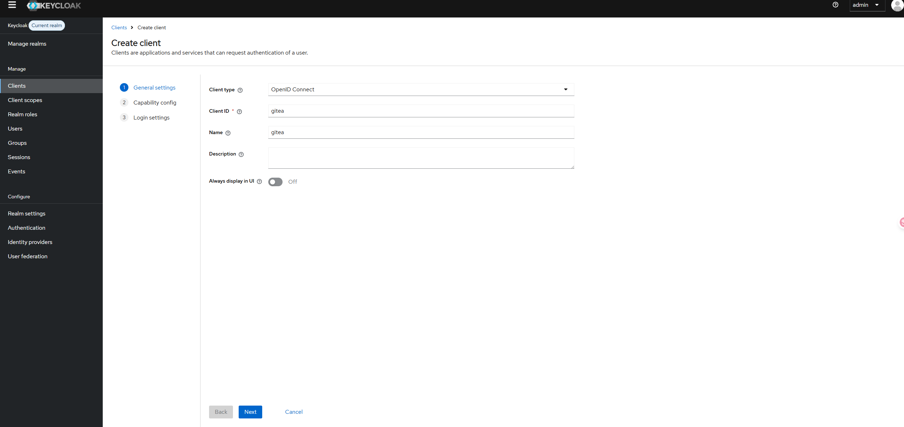

Enable the **Client authentication**.  
 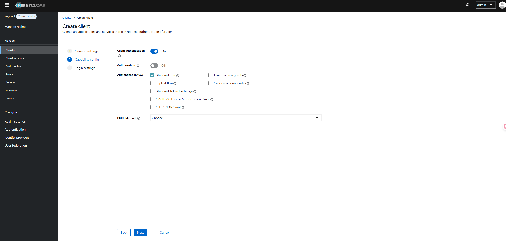

Configure the client by setting the **Root URL**, **Web origins**, **Admin URL** to the hostname (https://{hostname}).

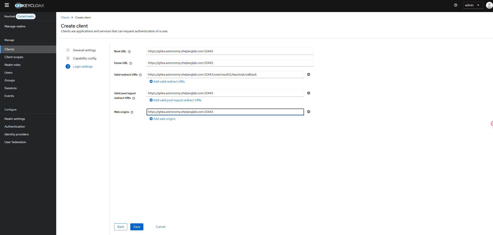

Make sure to click **Save**.

## Add a OIDC(keycloak) auth source in gitea
1. Click `Add Auth Source` button on `Auth Source Page`
    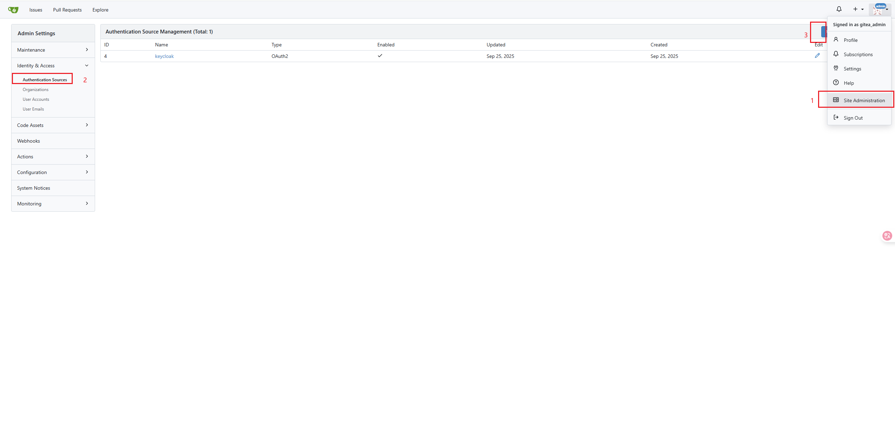
2. Config the OIDC auth source
    ```
    https://keycloak.astronomy.zhejianglab.com:32443/realms/master/.well-known/openid-configuration
    ```
    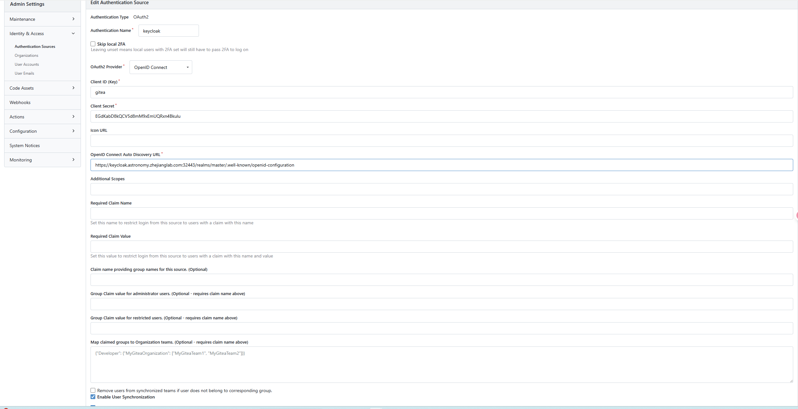

## Test login   
1. Use user and password from keycloak to login.    
   Return to the login page, and you'll find an additional "sign in with Keycloak" button.
   

   After clicking, you will be redirected to the Keycloak login page to log in using the user created in advance in Keycloak.
   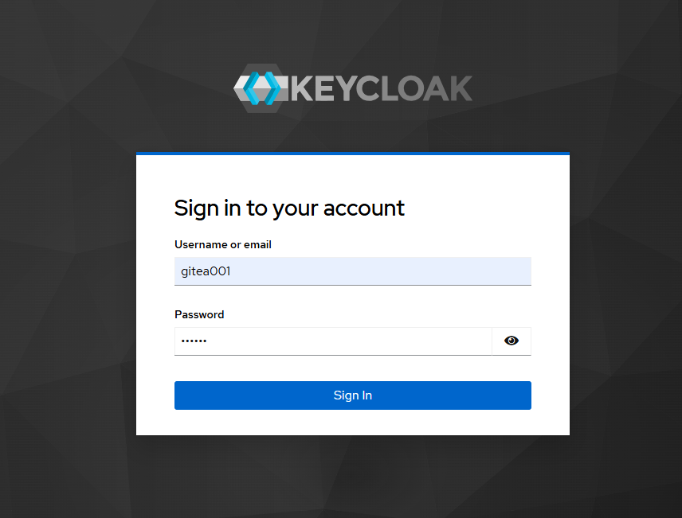

   If the authentication is successful, you will be returned to the interface for registering a user account on Gitea. If the entered user does not yet exist on Gitea, registration is required in the "Register New Account" section, mainly to determine the username and email address.  
   :::info
   If the gitea configuration "oauth2_client.ENABLE_AUTO_REGISTRATION" is set to "true", there will be no this redirection, and accounts from Keycloak will be automatically registered.
   :::
   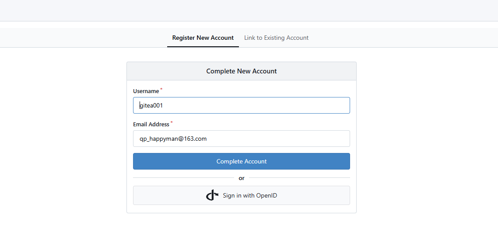
   After that, you can log in normally through Keycloak.
   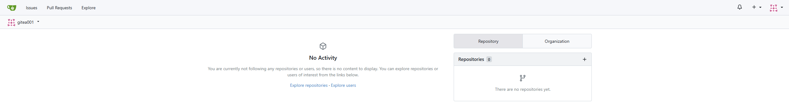


## Set Gitea administrator privileges for the user
1. On the Keycloak side, create a role `gitea_admin` with administrator privileges through "Realm Roles" > "Create Role" 
   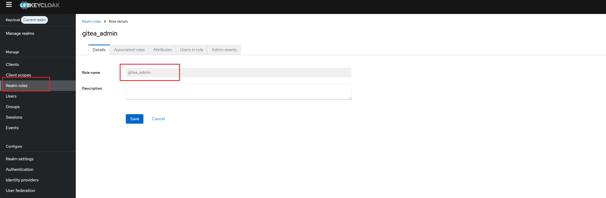
2. Create a user named `gitea_admin_user` and assign `gitea_admin` to it from the "Role Mapping" tab
   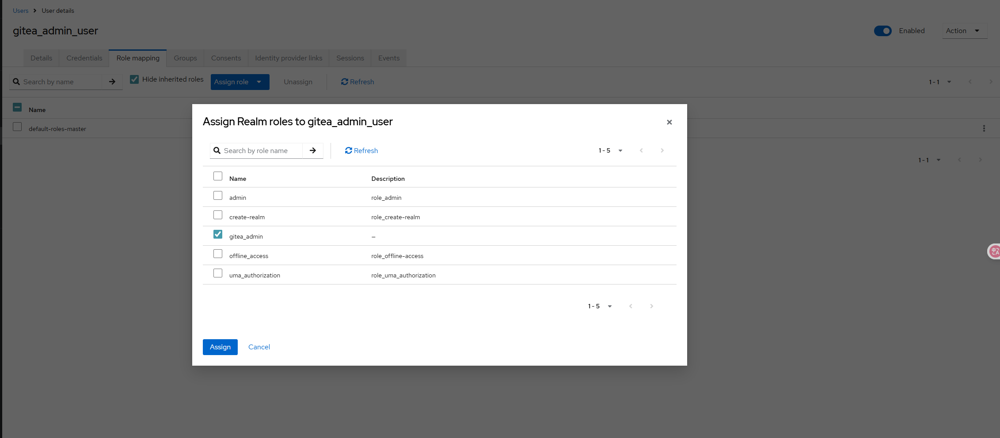
3. Select "Clients" > "gitea (Client ID)" > "Client Scopes" tab > "gitea-dedicated", and Add predefined mapper, find "groups" and add
   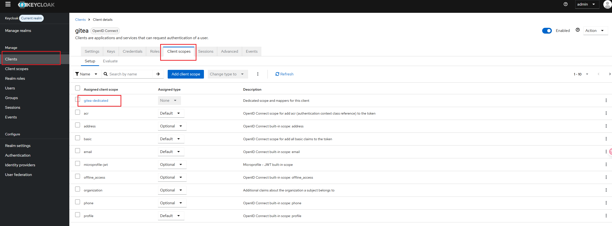
   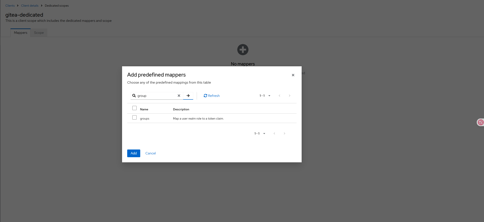
4. In the Gitea configuration, edit the OIDC authentication source you previously created and add the following items
   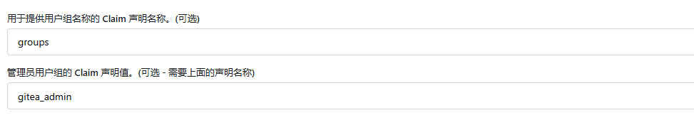
5. Using the user `gitea_admin_user` for single sign-on(keycloak), you will find that this user has admin privileges
   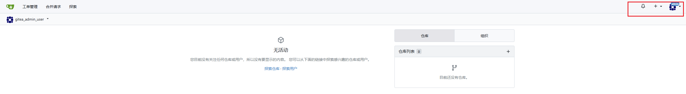

## References
1. https://zenn.dev/zenogawa/articles/gitea_keycloak