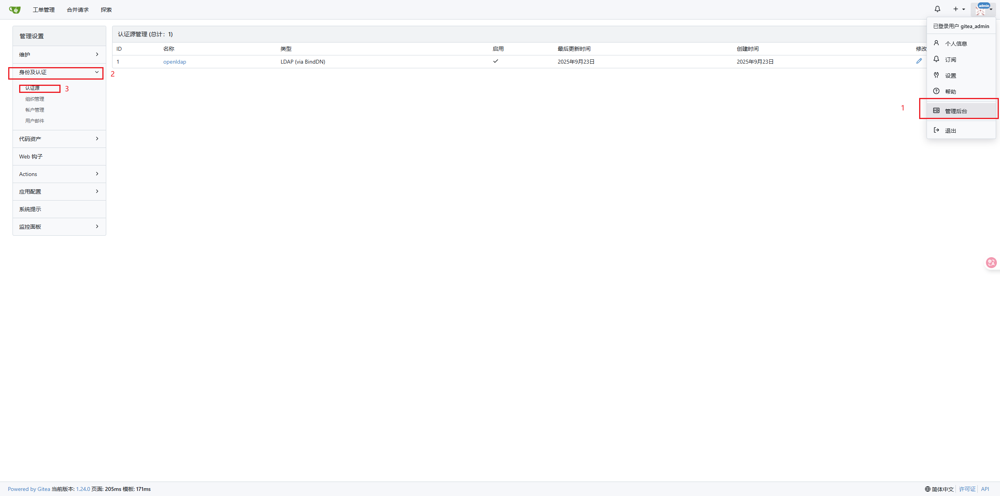
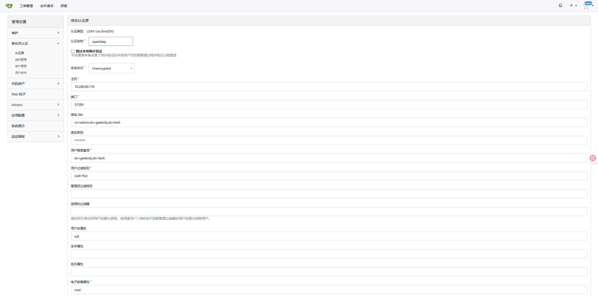
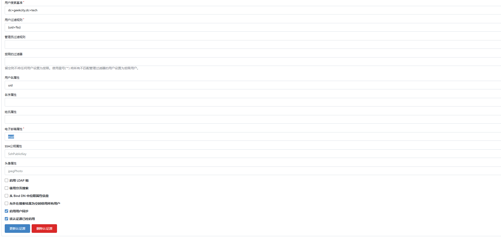
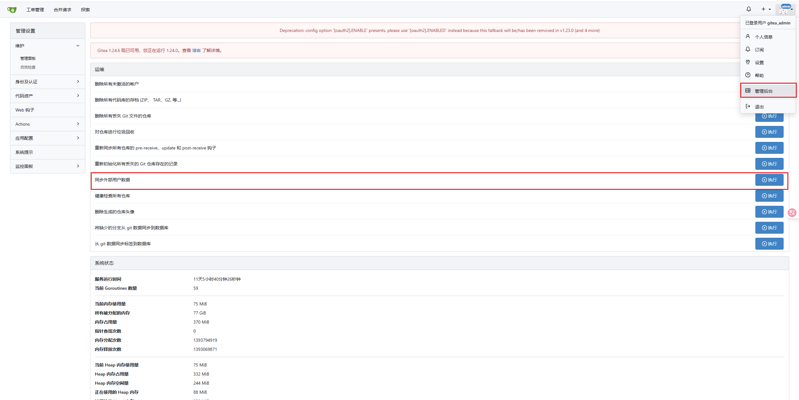
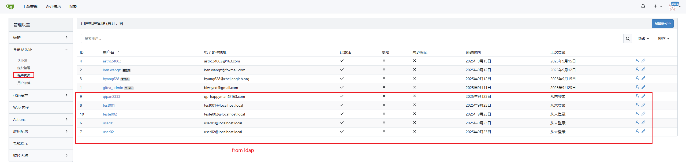

## Precontidions
1. [Install the OpenLDAP](/docs/notes/others/openldap/Install)

## Add a ldap auth source for gitea
1. Click `Add Auth Source` button on `Auth Source Page`
    
2. Config the ldap auth source
    ```
    cn=admin,dc=geekcity,dc=tech
    dc=geekcity,dc=tech
    (uid=%s)
    uid
    mail
    ```
    
    :::warning
    The page allows configuration of "Enable User Sync," but there is no explanation of how often the synchronization occurs. After waiting for a long time, no automatic sync operation took place, making it unclear whether this feature is functional
    :::
    
3. Sync user from LDAP server manually.
    
    
4. Use user and password from ladp to login.