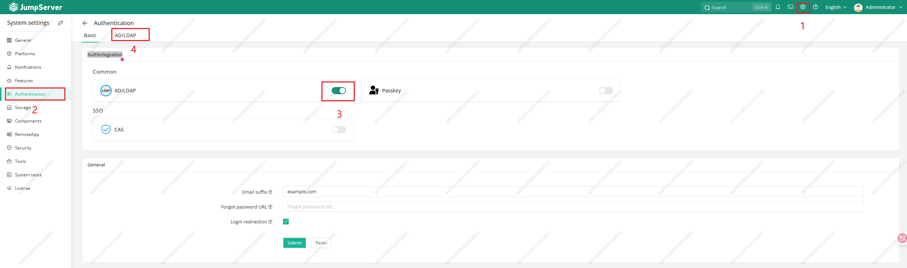
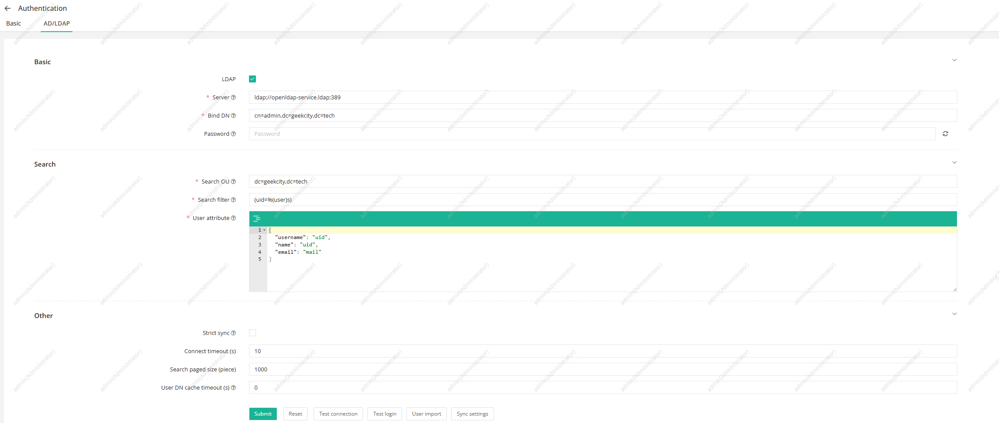
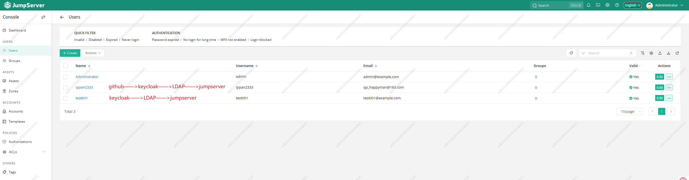
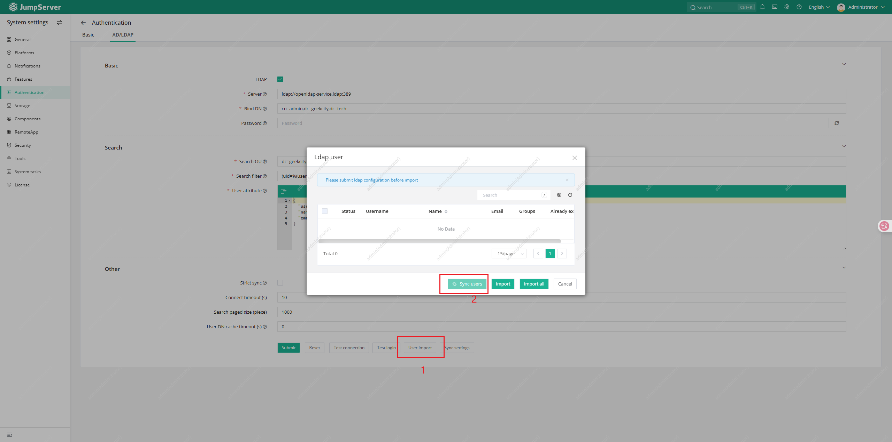

## Preconditions
1. [Install the OpenLDAP](/docs/notes/others/openldap/Install)

## Integration


```
ldap://openldap-service.ldap:389

cn=admin,dc=geekcity,dc=tech

dc=geekcity,dc=tech

(uid=%(user)s)
{
  "username": "uid",
  "name": "uid",
  "email": "mail"
}
```


## Sync Users from LDAP Server
1. Login with user existed in LDAP server, then the user will be sync to jumpserver.
   - qipan2333 was originally a GitHub account, which was recorded after logging into Keycloak and then synchronized to LDAP.
   - test001 was a account created by Keycloak, which was also synchronized to LDAP by Keycloak.
    
2. Import users from LDAP server manually.
   :::warning
   After clicking the "Sync User" button, there is no response on the page, no HTTP request is sent, and no logs are printed in the background. The reason for the failure is unknown.
   :::
   