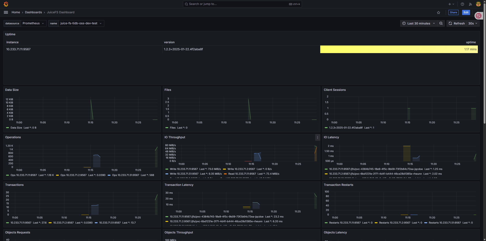

The official JuiceFS provides client-side monitoring solutions.

1. Prepare juicefs-mounts-monitor.yaml``
    ```yaml title="juicefs-mounts-monitor.yaml"
    apiVersion: monitoring.coreos.com/v1
    kind: PodMonitor
    metadata:
    name: juicefs-mounts-monitor
    labels:
        release: kube-prometheus-stack
    spec:
    namespaceSelector:
        matchNames:
        - storage
    selector:
        matchLabels:
        app.kubernetes.io/name: juicefs-mount
    podMetricsEndpoints:
    - port: metrics
        path: '/metrics'
        interval: 10s
    ```

2. Apply
    ```bashj
    kubectl -n monitor apply -f juicefs-mounts-monitor.yaml
    ```

3. Import dashboard  

    The official JuiceFS-maintained dashboard templates can be found in the Grafana Dashboard repository. You can directly import them into Grafana using the link https://grafana.com/grafana/dashboards/20794/ or by searching for ID 20794.
    